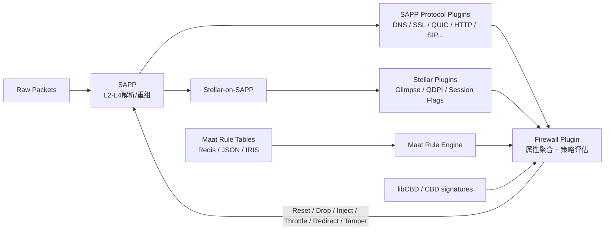

> **论文定位**：这不是一篇典型的“提出新模型并刷 benchmark”的论文，而是一篇非常少见的**白盒系统取证 + 软件考古 + 动态复现 + 网络测量指纹**研究。作者利用一次商业 DPI（Deep Packet Inspection，深度包检测）系统源码泄露，重建 Geedge Networks 的 Tiangou Secure Gateway（TSG，天狗安全网关），再把源码中发现的“实现怪癖”转换成可远程观测的网络指纹，最后与中国 GFW 等真实审查设备的行为进行比对。

---

## 开头：发表信息、CCF 级别与开源情况

- **论文题目**：*Technical Analysis of the Geedge Networks Firewall Source Code Leak*
- **发表会议**：**35th USENIX Security Symposium（USENIX Security '26）**。
- **发表时间与地点**：2026 年 8 月 12–14 日，美国 Baltimore, Maryland。论文已收录于 USENIX Security '26 Proceedings。
- **CCF 级别**：**CCF-A**，所属方向为“网络与信息安全”。USENIX Security 与 IEEE S&P、ACM CCS、NDSS 同列 CCF 网络与信息安全 A 类会议。
- **论文主页 / Open Access**：USENIX 页面提供公开论文：<https://www.usenix.org/conference/usenixsecurity26/presentation/ablove>
- **CCF 官方目录**：<https://www.ccf.org.cn/Academic_Evaluation/NIS/>
- **实验工件（Artifacts）**：作者在 Zenodo 公开了测量脚本、扫描结果、匿名化 PCAP 等实验材料：<https://zenodo.org/records/20274003>
- **是否“开源”需要精确区分**：
  - ✅ **论文与测量实验工件公开**，包括 TLS length-field scanner、QUIC 测量、IP fragmentation、DNS injection、TCP RST fingerprinting 等结果和脚本（论文 Open Science 部分）。
  - ❌ **泄露的 Geedge 源代码与作者重建出的可运行 TSG 部署没有公开发布**。作者明确指出，这是出于伦理风险考虑，避免降低审查系统的部署门槛；其本地构建只会在请求后向可信的网络安全研究者/机构提供。

> 📌 **一句先验判断**：这篇论文真正的价值，不是“又发现了几个 GFW 特征”，而是第一次把一个商业级、国家级审查 DPI 的**内部实现**与过去几十年基于黑盒测量得到的外部现象连接起来，从而建立了“**源码实现 → 可观测指纹 → 真实部署归因**”的证据链。

---

## 1. 摘要 (Abstract) 与核心贡献 (Core Contribution)

### 一句话总结

作者对 2025 年泄露的 Geedge Networks 商业 DPI 源码进行系统化分析，成功重建并运行其核心产品 TSG，解析其数据面、协议解析、应用识别和封锁规则机制，并进一步从源码实现中提取 DNS/TCP/TLS/QUIC 等远程指纹，用真实网络测量证明部分 GFW 组件与 TSG 或其近似/历史版本高度一致。

### 贡献列表 (Contribution List)

- **贡献 1：首次系统重建商业级国家审查 DPI 的内部架构。**作者跨越 500+ Git 仓库和多个版本/分支，梳理出以 **SAPP → 协议插件 / Stellar → Firewall → Maat → 阻断动作**为核心的 TSG 工作流，并成功构建、运行最新 tagged release，使论文从“静态读源码”提升到“可动态验证的系统分析”。

- **贡献 2：揭示 TSG 的应用识别与封锁机制，以及其真实工程开发方式。**论文分析了 CBD、Glimpse、QDPI 三套检测体系，展示了 VPN / Tor / Psiphon 等规避工具如何被基于 IP、域名、JA3/JA4、证书、payload 长度与字节模式等多条件识别；同时 Jira/Confluence 记录证明规则开发是一个**客户驱动、持续迭代、需要处理误封（collateral damage）**的工程过程。

- **贡献 3：把源码“实现怪癖”转化为网络侧指纹，并与真实审查部署建立对应。**包括 DNS 的 17/18 compression-pointer 边界、RST 伪随机字段生成器的默认 `seed_key = 13`、IP 分片重组边界、TLS 长度字段解析差异、QUIC 版本与重组行为等。最强证据包括：**GFW DNS Injector 2 与 TSG DNS 行为高度一致，GFW II/III 的 TCP RST 均稳定恢复出 `k=13`**，而 GFW II 的 TLS 行为与一个较旧 TSG SSL 版本吻合。

---

## 2. 引言 (Introduction)：问题背景与研究动机

### 2.1 问题定义 (Problem Definition)

论文要解决的核心问题可以拆成两层：

1. **白盒层面**：一个现代商业 DPI 审查系统到底如何接收流量、重组连接、解析协议、抽取特征、识别应用、匹配审查策略并执行阻断？
2. **外部归因层面**：能否把源码中的实现细节变成远程网络指纹，从而判断某个国家/地区实际部署的审查中间盒是否使用了 TSG、其旧版本，或者与 TSG 共享了代码？

这个问题对学术界与工业界都重要。过去研究 GFW、俄罗斯 TSPU、伊朗审查系统等，几乎只能依赖**黑盒网络测量**：研究者发送精心构造的流量，再根据 RST、丢包、DNS 注入等外部响应推断内部逻辑。这样的研究可以发现“它做了什么”，却很难回答“**为什么会这样做、是哪段代码导致的、不同异常行为之间是否属于同一系统**”。

而这次泄露提供了罕见的白盒视角：超过 100K 内部文件、约 572 GiB 数据、500+ Git 仓库以及多年的 commit 历史。论文因此可以第一次把“审查系统的外在行为”与“商业 DPI 的内部源码”对齐。

### 2.2 现有方法的局限 (Limitations of Prior Work)

#### 局限一：纯黑盒测量存在根本性不可辨识问题

传统方法通过网络响应推断中间盒行为，但同一种现象可能由多个不同内部机制产生。例如：

- 一个 TLS ClientHello 没被封锁，可能是目标中间盒没有解析成功；
- 也可能是解析成功但策略未命中；
- 也可能第一台设备放过了，但后面的第二台设备进行了处理；
- 对于“丢包型”审查，还经常无法区分到底是哪台设备做的。

因此黑盒测量天然存在“**行为相似 ≠ 实现相同**”的问题。

#### 局限二：开源 DPI 不能完全代表国家级商业系统

Snort、Suricata、Zeek、nDPI 等开源项目非常有研究价值，但它们并不是一个国家级审查网关的完整实现。TSG 不只是协议分类器，而是一个包含：

- L2–L4 流处理；
- 应用层协议解析；
- 多套应用识别器；
- 规则匹配；
- RST / 丢包 / 重定向 / 限速 / 篡改；
- 日志与运营支持；

的完整系统。因此“看一个开源 DPI 的 parser”无法代表真实商业审查基础设施。

#### 局限三：即使有源码，源码本身也极难解释

作者面对的不是一个整洁单仓库项目，而是 500+ Git repositories、多版本、多分支，以及同一层协议存在不同实现。例如论文明确提到至少有两套不同的 IP/UDP/TCP stack。TSG 的逻辑还被拆散在多个仓库和 RPM 包中。

因此，**“源码泄露”并不等于“系统架构天然可见”**。作者真正做的是一种系统级软件考古。

### 2.3 本文思路 (Overall Idea)

整篇论文最值得学习的是它的研究闭环：

> **静态代码分析 → 系统架构复原 → 本地动态运行 → 提取可远程观测的实现差异 → 真实国家/地区测量 → 与源码和历史版本再次对齐。**

可以概括成四步：

1. **Code Archaeology**：从海量 repo / RPM / Jira / Confluence 中定位关键组件。
2. **System Reconstruction**：根据最新 build manifest 重建 TSG，并在隔离环境中运行。
3. **Fingerprint Synthesis**：从 parser 边界、伪随机算法、硬编码字段等处提取“实现级指纹”。
4. **Internet Measurement**：在中国、哈萨克斯坦、缅甸、巴基斯坦、伊朗等路径上发送特制报文，比较真实中间盒与本地 TSG 的响应。

这条链路正是本文最核心的方法学贡献。

---

## 3. 方法论深度解析 (In-depth Methodological Analysis)

## 3.1 整体架构 (Overall Architecture)

论文 **Figure 1** 是理解全文最关键的一张图。它展示了 TSG 从原始数据包进入，到特征提取、应用识别、规则评估和最终阻断的整体流程。

下面用一个简化 Mermaid 图复述 Figure 1 的核心结构：



### 数据是如何流动的？

#### 第一步：Raw Packet Ingress → SAPP

原始报文先进入 **SAPP（Stream Analysis Process Platform）**。SAPP 是整个 TSG 的底座，负责：

- Ethernet / IP / UDP / TCP 等 L2–L4 处理；
- TCP/UDP stream 建立与状态维护；
- VLAN、PPPoE、VXLAN 等隧道/封装协议；
- 将重组后的流交给上层插件。

SAPP 的重要性类似“高性能网络数据面 + 插件运行时”。它自己并不决定某个网站是不是应该被封，而是提供“把包整理成可分析对象”的基础设施。

#### 第二步：两条并行分析路径

从 SAPP 出来后，数据并不是只走一个 detector，而是存在至少两条主要路径：

1. **SAPP Protocol Plugins**：DNS、SSL/TLS、QUIC、HTTP、SIP 等插件进行协议识别和字段抽取；
2. **Stellar-on-SAPP → Stellar Plugins**：把 SAPP stream 转换成 Stellar session，再交给 Glimpse、QDPI 等应用识别插件。

这两个路径可以并行工作，并且各自产生不同种类的信息。

例如，一个流可能：

- 被 Glimpse 判断为“QUIC”；
- 同时又被 QUIC 协议插件解析出 SNI；
- Firewall 最后再把“应用类型 = QUIC”“server IP = X”“SNI = Y”聚合起来做规则判断。

#### 第三步：Firewall 聚合属性并调用 Maat

**Firewall plugin** 是整个系统真正的“决策汇合点”。它同时接收：

- SAPP protocol plugin 的回调结果；
- Stellar message bus 中的应用识别消息；
- CBD / libCBD 应用签名结果；
- Maat 中配置的规则。

然后根据规则决定是否执行阻断。

#### 第四步：阻断动作回到 SAPP 数据面

Firewall 作出决定后，最终还是调用 SAPP stream API 完成实际干预，例如：

- drop stream；
- drop current packet；
- inject TCP RST；
- 注入 DNS / HTTP / SIP / mail 响应；
- throttle；
- payload tampering；
- deferred blocking（处理若干包后再阻断）。

### 这个架构的核心思想是什么？

**核心思想是“多路并行提取信息，最后集中聚合决策”。**

论文在 Discussion 中明确强调：过去研究者常把“一条网络路径上有多个 middlebox”作为复杂性来源，但 TSG 告诉我们，**即使只是一台 middlebox 内部，也可能存在多个相互独立的识别子系统**。

这是非常重要的认知变化：

> 一个审查设备不是“一个 parser + 一套规则”，而更像是“多个异构 detector 并行投票/提供证据，然后由统一 firewall 汇总”。

这也解释了为什么黑盒测量中经常出现看似矛盾的行为。

---

## 3.2 核心组件/模块拆解 (Core Component Breakdown)

### 3.2.1 SAPP 与协议插件：负责“把流量变成结构化属性”

#### 输入与输出

- **输入**：原始 Ethernet/IP/TCP/UDP 报文。
- **输出**：重组后的 stream，以及由协议插件抽出的结构化字段。

典型字段包括：

- DNS：query domain、type、class、response records、DNSSEC 相关记录；
- TLS/SSL：SNI、cipher suites、extension length、JA3/JA4、证书 issuer/subject/SAN；
- QUIC：SNI、user-agent、version 等。

#### 内部机理

SAPP 把基础包处理与业务逻辑分开。插件通过 `*.inf` 注册到特定 stream 类型，主要分为：

1. **platform plugin**：提供共享能力；
2. **protocol plugin**：解析具体协议；
3. **business plugin**：消费协议字段并实现业务逻辑。

Firewall 本身就是一个 business plugin。

另一个关键点是：SAPP 暴露了 stream control API。例如论文 §3.1 描述的 `MESA_set_stream_opt` 可以设置：

- `MSO_DROP_STREAM`：后续整个流全部丢弃；
- `MSO_DROP_CURRENT_PKT`：只丢当前包。

因此 SAPP 既是解析平台，也是最终执行封锁动作的数据面。

#### 设计动机

这样设计的好处是把“高性能底层处理”和“不断变化的审查策略/协议识别”分离。对于一个长期运营的 DPI 厂商，协议和应用会不断新增，插件化明显比修改单体程序更易维护。

但它也带来一个副作用：**版本组合高度碎片化**。论文特别提醒——识别出某个插件的指纹，并不意味着同一个部署中的其他插件也是同版本。

这直接影响后面的归因逻辑。

---

### 3.2.2 Maat + Firewall：负责“把属性变成审查决策”

#### 输入与输出

- **输入**：
  - SAPP / Stellar / CBD 提供的流属性；
  - Maat 中配置的规则表。
- **输出**：
  - allow / deny 等策略结果；
  - drop、RST、redirect、throttle、tamper 等具体动作。

#### 内部机理

**Maat** 被作者描述为统一的 network flow processing configuration framework，本质上是一个规则匹配引擎。规则可通过三种方式加载：

- Redis；
- JSON；
- IRIS（索引文件 + data table）。

论文 **Table 2** 给了最直观的例子：封锁 `blocked.com` 的规则会匹配：

- `attribute_name = ATTR_SERVER_FQDN`
- `expression = blocked.com`
- `match_method = full`
- `action = Deny`
- `sub_action = drop`
- 并可配置 `send_tcp_reset = 1`

也就是说，在概念上可以把 Firewall 看成：

$$
\text{Decision} = \text{MaatScan}(\text{AggregatedAttributes},\; \text{RuleTables})
$$

这里的重点不在这个形式化本身，而在“**AggregatedAttributes**”：规则可以同时匹配 transport、application、tunnel、IP、port、FQDN/SNI、ASN、country，甚至首个 client→server / server→client payload。

因此 TSG 的检测能力不是单一特征匹配，而是**跨层、多条件组合**。

#### 阻断动作为什么值得关注？

论文 §3.5.1 显示它支持的动作远不止“封掉连接”：

- TCP RST；
- packet / stream drop；
- HTTP 302/303 redirect 或 200/204/403/404 响应；
- DNS redirect；
- SIP / mail 协议级伪造错误；
- session / packet throttling；
- payload tampering；
- deferred blocking。

这说明 TSG 的角色已经不是传统意义上的“防火墙”，而更接近一个**可编程的 inline traffic manipulation platform**。

#### 设计动机

把规则从解析器中抽出来有两个好处：

1. **策略变化无需修改 parser**；
2. 一个抽出的属性可以被多个规则复用，并与其他 detector 的结果组合。

这与 Figure 1 中“多个路径最终汇总到 Firewall”的思想完全一致。

---

### 3.2.3 CBD、Glimpse、QDPI：负责“这个流量到底是什么应用？”

TSG 至少存在三套重要的 application detection system。

#### A. CBD（Context-Based Detector）

CBD 是 TSG 最核心的应用指纹系统，早期叫 AppSketch，后来通过 `libcbd` 集成到 firewall。

它的 signature 可以匹配：

- server IP；
- domain / SNI；
- JA3 / JA4；
- TLS certificate issuer 等字段；
- payload 长度；
- payload 字节模式；
- 已有的 application ID。

论文 **Table 4** 展示了多个 VPN / circumvention signature。例如：

- ExpressVPN：JA3；
- Flash VPN：certificate issuer；
- HideMe VPN：首个 UDP client→server payload 的长度与字节模式；
- Ultrasurf：FQDN pattern + JA3；
- Psiphon：协议 app-id、顶级域后缀、上千个 CDN IP range，同时排除数万条合法 FQDN whitelist。

这里最值得注意的不是某一个具体特征，而是：**一个 signature 可以是多个条件的逻辑 AND**。

因此，规避某一个特征并不一定足够。

#### B. Glimpse

Glimpse 的基础协议识别能力大量基于第三方开源库 **libprotoident**。libprotoident 只用双向 payload 的前几个字节进行轻量分类。

此外，论文发现 Glimpse 的 OpenVPN detector 与 2022 年版本的 nDPI 实现高度相似，只是函数名等被修改。

这说明 Geedge 并不是从零实现所有 detector，而是通过“基础第三方分类器 + 自研定制规则”组合能力。

#### C. QDPI

QDPI 基于商业 DPI 引擎 **Qosmos ixEngine**。论文根据代码中的 `qmdpi_worker_process`、`qmdpi.h`、RPM shared object 以及 AppSketch DB 的内容关系确认了这一点。

Qosmos ixEngine 据称可分类数千种协议和应用，因此 QDPI 可以提供非常广泛的 baseline classification。

#### 设计动机：为什么要同时使用三套检测器？

这是本文一个非常重要的工程结论：

> **“识别所有协议/应用”本身非常昂贵。即使是资源充足、与国家审查体系关系紧密的厂商，也大量依赖第三方 DPI。**

更现实的工程策略是：

- 用商业/开源引擎做“大范围识别”；
- 用 CBD 做“高价值目标的精细 signature”；
- 用 Firewall/Maat 把不同 detector 的结果进行组合。

这比追求一套“完美单体 classifier”更符合实际产品逻辑。

---

## 3.3 关键公式与算法 (Key Equations and Algorithms)

### 3.3.1 TCP RST Header 的伪随机生成：一个“试图伪装随机、反而留下指纹”的算法

论文 **Listing 1 / §6.3** 是全文最漂亮的一个技术点。

TSG 在注入 TCP RST 时，可以进入 `signature_mode`，用一个自定义伪随机算法设置：

- IPID；
- TCP Window；
- TTL。

忽略 `win == 0` 的特殊情况后，论文把实现化简为：

$$
win = val + (dip \bmod k)
$$

$$
ipid = M - val \cdot k + (sip \bmod win)
$$

其中：

- $sip$：被终止 TCP 流的 source IP；
- $dip$：destination IP；
- $val$：内部递增状态；
- $k$：`seed_key`，TSG 默认值为 **13**；
- $M$：`seed_max_val`，默认 **65535**；
- $win$：注入 RST 的 TCP Window；
- $ipid$：注入 RST 的 IPv4 ID。

### 公式的目标 (Objective)

从产品设计角度，它的目标是让每次注入的 IPID / window / TTL 看起来“不是固定常量”，从而降低显眼的静态指纹。

### 各部分含义 (Meaning of Terms)

问题在于，`win` 与 `ipid` 不是独立随机量，而被同一个 $val$ 和 $k$ **代数耦合**。

因此如果拿到两条伪造 RST 包 $i,j$，就可以消掉内部状态并反推出 $k$：

$$
k =
\frac{
(ipid_i-ipid_j)+[(sip\bmod win_j)-(sip\bmod win_i)]
}{
win_j-win_i
}
$$

### 公式的直觉 (Intuition)

这相当于设计者用一个“看起来在变化”的序列隐藏设备身份，但因为变化遵循过于简单、固定的代数结构，研究者反而可以从多个样本中恢复隐藏参数。

> **随机化没有消除 fingerprint，而是把 fingerprint 从“固定字段值”升级成了“固定字段关系”。**

这是一个非常值得泛化到其他安全研究的问题：**结构性相关性往往比单个常量更稳定。**

论文 Table 7 中，GFW II 与 GFW III 均稳定恢复出：

$$
k=13
$$

与 TSG 默认值完全一致。作者估计这种稳定关系随机出现的概率约为 $10^{-44}$，因此这是全文最强的部署关联证据之一。

---

### 3.3.2 IP Fragment Reassembly 的 off-by-one：代码级错误如何变成远程指纹

论文 **Listing 2 / §6.2** 展示了另一个很典型的“实现细节 → 远程 fingerprint”。

代码中定义：

```c
#define IPV4_FRAG_NUM_PER_IPQ (100)

if (ipv4_qp->frags_num > IPV4_FRAG_NUM_PER_IPQ) {
    ... ignore ...
}

...
ipv4_qp->frags_num++;
```

关键在于：

1. 先检查 `frags_num > 100`；
2. 最后才执行 `frags_num++`。

如果计数从 0 开始，那么：

- 第 101 个 fragment 到来时，检查的是 `100 > 100`，条件仍为 false，因此第 101 个 fragment 仍会被处理；
- 第 102 个 fragment 到来时，才看到 `101 > 100`，开始进入 ignore。

所以虽然宏定义写的是 100，真实行为边界却是：

$$
N_{max}=101
$$

这就是典型的 **off-by-one fingerprint**。

### 直觉

网络协议规范通常给出的是“允许什么”，但真正区分具体实现的往往是：

- 边界判断写 `<` 还是 `<=`；
- 计数器何时更新；
- 遇到 malformed input 是 continue、return 还是 fallback。

这些细节通常不会出现在产品手册，却非常适合做版本级实现指纹。

---

## 4. 实验设计与结果分析 (Experimental Design and Results Analysis)

## 4.1 实验设置 (Experimental Setup)

这篇论文没有传统机器学习论文中的 train/test dataset、Accuracy/F1，而是一个**系统与网络测量实验**。

### 数据与系统来源

论文 **Table 1** 将 572 GiB 泄露内容拆成：

- `mirror/repo.tar`：463.0 GiB，包含 Firewall、libCBD、QDPI、Glimpse 等 RPM；
- `mesalab_git.tar.zst`：59.4 GiB，包含 SAPP、Protocol Plugins、Stellar、Maat、`tsg-os-buildimage` 等；
- Confluence：46.4 GiB；
- Jira：2.5 GiB；
- 其他文件。

作者以 `tsg-os-buildimage` 的最新 tagged release **rel-24.10** 的 `manifest.yaml` 为关键锚点，把多个 repo/RPM 版本对应起来（见 **Figure 4**）。

### 本地测试环境

作者成功运行 TSG，并搭建了一个受控 Docker testbed（**Figure 6**）：

- client container；
- DPI container；
- user-space forwarder container；
- Kafka 用于日志可视化。

作者验证了 DNS、HTTP、TLS、QUIC，并成功触发：

- injection responses；
- packet drops；
- deferred blocking。

**Figure 7** 进一步显示，他们通过 Maat 定义了自定义应用 `CustomBlockedApp`，匹配 `blocked.com`，并在 Kafka 中观察到对应识别结果。

> 注：论文为了避免降低审查系统的部署门槛，没有公开完整 TSG 部署步骤。阅读时应把它当作“研究复现证明”，而不是部署教程。

### 远程测量对象 / Baselines

作者针对以下真实网络审查组件比较：

- 中国 GFW DNS Injector 1/2/3；
- GFW I / II / III TCP/TLS middleboxes；
- 河南地区性审查设备；
- 哈萨克斯坦；
- 缅甸；
- 巴基斯坦（RST 与 DROP 两类路径）；
- 伊朗 DNS injector。

测量协议包括：

- DNS；
- IP fragmentation；
- TCP RST；
- TLS ClientHello；
- QUIC Initial。

### 评价指标 (Metrics)

这里的“指标”是**实现行为是否匹配**，主要包括：

- DNS flags 是否一致；
- response 是否使用 compression pointer；
- 17/18 pointer jump 的 parser boundary；
- IP fragment 最大可重组数量；
- TCP RST 的 DF bit、flags、packet count；
- 是否能稳定恢复出 seed key $k$；
- TLS 各 length field 的 malformed permutation 是否被解析/封锁；
- QUIC version support 与 fragmentation/1200-byte minimum 等行为；
- Table 12 中“与 TSG 不同的 test vector 数量”。

这比单一准确率更像一个“behavioral signature vector”。

---

## 4.2 主实验结果 (Main Results)

### 结果 1：DNS —— GFW Injector 2 与 TSG 几乎形成“三重对齐”

论文 **Table 5** 中，TSG DNS 注入行为包含三个关键特征：

1. response DNS flags 固定为 `0x8180`；
2. answer name 使用 compression pointer；
3. parser 能处理 17 次 pointer jump，但 18 次失败。

真实测量中，只有 **GFW DNS Injector 2** 同时满足这三点。

这非常强，因为单看 `0x8180` 可能只是巧合，单看 compression 也可能是常见实现，但三个独立细节共同一致时，偶然重合的空间大幅缩小。

因此论文的判断是：**TSG 很可能提供了 GFW Injector 2 的 DNS injection implementation，或者两者至少共享极近的实现。**

这直接验证了作者的方法论假设：**源码中细小的 parser / packet-construction 决策，可以成为远程识别商业 DPI 的稳定证据。**

---

### 结果 2：IP Fragmentation —— GFW II 与 TSG 很接近，但证据弱于 DNS/TCP

论文 **Table 6**：

| 设备 | 观测到的重组边界 |
|---|---:|
| TSG | 101 |
| GFW I | ≥500 |
| GFW II | 102 |
| GFW III | 0 |
| Henan | 0 |
| Kazakhstan | 0 |
| Pakistan (RST) | 0 |
| Pakistan (DROP) | ≥500 |
| Myanmar | ≥500 |

TSG 源码推导为 101，而 GFW II 观测为 102，两者非常接近。

作者因此谨慎地说二者**可能共享相似代码**，而不是直接宣称“完全同一实现”。这种谨慎是合理的：fragment boundary 比 DNS 三重指纹更容易受到配置、外围设备和实现修改影响。

这个结果的价值在于它与后面的 TCP/TLS 证据形成**跨层一致性**：GFW II 多次表现出“像 TSG”。

---

### 结果 3：TCP RST —— `k = 13` 是全篇最有说服力的实现级指纹之一

论文 **Table 7**：

| Device | DF | TCP Flags | Count | Stable k |
|---|---|---|---:|---|
| TSG | ✓ | RST+ACK（可配置） | 1–3 | yes, $k=13$（默认） |
| GFW I | ✗ | RST | 1 | no |
| **GFW II** | ✓ | RST+ACK | 3 | **yes, $k=13$** |
| **GFW III** | ✓ | RST+ACK | 1 | **yes, $k=13$** |
| Henan | ✗ | RST+ACK | 1 | no |
| Myanmar | ✓ | RST+ACK | 1 | no |
| Pakistan | ✗ | 特殊 flags | 1 | no |

GFW II 与 GFW III 均能从大量 RST 对中稳定恢复出与 TSG 默认一致的 $k=13$。

更重要的是，这不是“某个 header 恰好等于 13”，而是**多个字段之间满足同一数学关系，反推出隐藏参数 13**。

因此它比普通静态 fingerprint 更有归因力。

不过作者也发现差异：

- GFW II / III 当前 TTL 固定为 255；
- 泄露版本 TSG 的 TTL 随内部 `val` 变化，范围约 48–247；
- 2023 年历史测量中的 GFW II TTL 反而更接近 TSG。

这说明一个重要事实：

> **真实部署可能基于 TSG，但已经做过定制、patch 或版本演进。**

所以正确结论不是“GFW == 当前泄露版本 TSG”，而是“某些 GFW 组件高度可能使用了 TSG 代码谱系”。

---

### 结果 4：TLS —— 最新 TSG 没有完全匹配对象，但 GFW II 与旧版 SSL 插件高度吻合

在 **§6.4、Table 8、Table 12** 中，作者系统修改 TLS ClientHello 的多个 length field：

- Record Length；
- Message Length；
- Session ID Length；
- Cipher Suite Length；
- Compression Methods Length；
- Extensions Length；
- SNI Extension Length；
- SNI List Length；
- SNI Name Length。

每个字段被设置成：

- 0；
- 正确值的一半；
- 两倍；
- 最大值；
- 某些字段还测试“长度刚好排除最后一个 extension”。

这种测试利用的是 parser ambiguity：不同实现面对“字段互相矛盾的 malformed ClientHello”时，会选择不同的边界来源和错误处理路径。

### 核心结果

- 没有一个真实 middlebox 与**最新泄露版 TSG**完全一致；
- **GFW II 只与 TSG 相差很少几个 test vectors**；
- 结合 Git commit 历史后，GFW II 的行为与**一个旧版本的 TSG SSL 模块**相符。

这一结果非常重要，因为它展示了源码泄露最大的独特价值：

> 黑盒研究只能说“GFW II 和 TSG 很像”；有 commit 历史后，可以进一步说“它更像 TSG 某个历史版本”。

这把 fingerprinting 从产品级提升到了**版本谱系（lineage）级别**。

---

### 结果 5：QUIC —— 哈萨克斯坦与旧版 TSG QUIC parser 对齐

TSG QUIC plugin 具有几个可测试特征（§6.5）：

- 强制 QUIC Initial datagram 至少 1200 bytes；
- 支持多种 pre-standardization / Google QUIC 版本；
- 支持 IETF QUIC；
- 能解析 encrypted Initial；
- 能重组跨 UDP datagram 的 CRYPTO frame fragmentation。

从 **Table 9 / Table 12** 可以看到：

- GFW 和 Kazakhstan 都会阻断一些与 TSG 相同的 test vectors；
- **Kazakhstan 的 parser fingerprint 与一个旧版本 TSG QUIC 实现完全匹配**；
- Myanmar 的 QUIC version support 与 TSG 一致，但 parsing fingerprint 不一致，因此不能确认使用 TSG。

这再次说明作者没有把“部分一致”夸大成“确定部署”。

---

### 4.2.1 把所有证据放在一起看

可以把论文的主要部署证据按强弱理解为：

| 证据 | TSG 特征 | 真实对象 | 归因强度 | 我的判断 |
|---|---|---|---|---|
| DNS | `0x8180` + compression + 17/18 pointer boundary | GFW DNS Injector 2 | **强** | 多个独立特征同时对齐 |
| TCP RST | 字段代数关系恢复 $k=13$ | GFW II / III | **很强** | 结构性指纹，偶然概率极低 |
| TLS | malformed length-field parser fingerprint | GFW II | **中-强** | 与旧版 TSG SSL 模块吻合 |
| QUIC | 版本 + parser 行为 | Kazakhstan | **中等** | 与旧版代码一致，但仍需部署 ground truth |
| IP fragmentation | 101 vs 102 重组边界 | GFW II | **弱-中** | 很接近，但单独不足以归因 |

**这组结果整体上很好地验证了作者的核心假设**：最可信的归因不是依赖一个特征，而是把多个协议层、多个代码模块和版本历史进行交叉验证。

---

## 4.3 消融实验 (Ablation Studies)

需要特别说明：**这篇论文没有机器学习论文意义上的标准 ablation table**，即没有“去掉模块 A 后 Accuracy 从 95% 降到 88%”这种实验。

如果强行把它套成消融会误读论文。

不过，它存在三类具有“准消融”意义的验证：

### 1. 分协议隔离：一次只测试一个实现特征

作者分别对 DNS、IP、TCP、TLS、QUIC 设计独立 test vector。这相当于把系统的大量行为拆成可控变量，避免“只看最终有没有封锁”这种粗粒度结论。

### 2. 版本/commit 变化：Table 12 实际上提供了版本级 intervention

Table 12 用 I–V 标注几个改变 parser 行为的 Git commit。

这很像软件系统研究里的“自然消融”：

- 某个 commit 前，某 length field 被接受；
- 某个 commit 后，行为改变；
- 再把真实 middlebox 的行为放到这条版本轴上。

所以本文最有价值的“消融”不是删模型模块，而是**利用版本历史寻找行为发生改变的最小代码差异**。

### 3. RST configuration 测试：证明某些外部差异可以由配置解释

作者在本地测试中确认 TSG 的 RST：

- 数量可配置为 1–3；
- flags 可选 RST / RST+ACK；
- signature mode 可控制 IPID/window/TTL 生成。

这解释了为什么 GFW II 与 GFW III 虽然 count 不同，却仍可能来自同一 TSG 代码家族。

### 哪部分对最终结论贡献最大？

如果按“对部署归因的证据增益”排序，我认为：

1. **TCP RST 的 `k=13` 代数指纹**贡献最大；
2. **DNS 三重指纹**次之；
3. **TLS + commit 历史的版本对齐**提供了非常重要的补强；
4. IP fragmentation 单独较弱，但作为跨层证据有价值。

这与方法论拆解是一致的：**越靠近具体实现逻辑、越难由常规配置偶然产生的特征，归因力越强。**

---

## 4.4 具体实现细节

### 构建链路

**Figure 4** 展示了作者如何从 `tsg-os-buildimage` 的 `manifest.yaml` 反推 RPM 依赖并关联 commit hash。最新 tagged release 为 `rel-24.10`。

TSG 最新构建基于 **SAPPv4**。SAPP 主配置为 `sapp.toml`，其中又加载 `conflist.inf` 来控制 DNS、SSL、QUIC 等插件。

作者遇到商业许可证检查问题并最终让研究用构建可以在隔离环境运行；论文只公开到足够支撑研究结论的层级，没有公开一套可直接复用的完整部署流程。

### Testbed

**Figure 6** 的 Docker 环境非常值得系统安全论文学习：

- client 与 DPI 在隔离 bridge network；
- forwarder 负责必要的 L2/MAC 转发处理；
- Internet 流量经过 TSG；
- Kafka 记录应用识别/策略事件。

这样既能产生真实网络协议流量，又把实验控制在研究者自己的两个端点之间，降低第三方影响。

### Measurement methodology

TLS 测量中，每种 permutation 在各国 vantage point 发送 20 次；只有至少 $2/3$ 试验观察到已知 censorship 行为才计为“被封锁”，并进行了两轮完整测量。

作者还专门处理 residual censorship：

- 对 3-tuple residual censorship 等待 timeout；
- 对 4-tuple residual censorship 使用新的 client port。

这些细节虽然不“炫技”，但对网络测量论文可信度非常重要。

---

## 5. 讨论与思考 (Discussion and Reflection)

## 5.1 优点与创新点 (Strengths & Innovations)

### 优点 1：把白盒与黑盒证据真正闭环

很多论文做 reverse engineering，另一些论文做 Internet measurement，但这篇工作的罕见之处在于：

> **源码阅读 → 本地可运行系统 → 构造异常输入 → 观察本地行为 → 对外真实测量 → 回到 Git 历史解释差异。**

这条证据链显著降低了单纯行为推断的不确定性。

### 优点 2：没有把 TSG 错误地抽象成“一个 DPI classifier”

Figure 1 给出的多路径架构是一个很重要的现实修正：同一台设备里可能同时存在协议 parser、第三方 DPI、CBD signature 和规则引擎。

这使研究者开始从“某个 middlebox 的唯一 classifier”转向“**一个中间盒内部存在多个并行、部分重叠的识别流程**”。

### 优点 3：版本意识非常强

作者没有看到 GFW 与最新 TSG 不完全一致就停止分析，而是利用 commit 历史把行为映射到旧版本。

这实际上建立了一个很有潜力的方法：**通过 parser quirks 做远程 software version lineage inference**。

### 优点 4：把技术系统与真实运营流程连接起来

论文对 Jira ticket 的分析让我们看到，VPN signature 不是实验室里“一次性设计出来”的，而是：

- 客户报告“封不住”；
- 厂商提取新特征；
- 客户重新验证；
- 出现误封；
- 加 whitelist；
- 不同目标按客户优先级推进。

**Figure 2 / Figure 3** 是非常少见的“审查系统 DevOps”证据。

### 优点 5：伦理处理相对完整

作者没有公开泄露源码与可运行 firewall build，而是公开对复现实验有帮助的 scanner、PCAP 和结果，并明确解释取舍。对于这种高度敏感、容易双重用途的系统研究，这是合理且成熟的处理。

---

## 5.2 局限性与可商榷之处 (Limitations & Debatable Points)

### 局限 1：泄露只是一个时间截面

泄露材料最新大约到 2024 年 11 月，而真实网络部署在 2025/2026 可能已经继续修改。

因此：

- “当前真实设备不完全匹配泄露版本”并不令人意外；
- 反过来，“匹配旧 commit”也不能证明设备之后没有发生私有 patch。

论文已经意识到这个问题，但它仍然是所有结论的时间边界。

### 局限 2：TSG 的模块化使“产品级 fingerprint”本身就很难定义

这是论文既揭示又无法完全解决的难题。

假设一台真实设备使用：

- SAPP v4；
- 旧版 SSL plugin；
- 新版 QUIC plugin；
- 某个定制 QDPI bundle；
- 客户私有 Maat rules；

那么问“它是不是 TSG？”已经不是一个二元问题。

更合理的问题是：

> **它有哪些组件属于 TSG code lineage？各组件版本分别是什么？**

论文已经朝这个方向走，但未来应该把这种 component-level attribution 明确形式化。

### 局限 3：相似实现不等于唯一归因

虽然 `k=13` 等证据很强，但从科学方法上仍需区分：

1. 运行了 Geedge TSG 产品；
2. 使用了相同内部代码；
3. 使用了从同一旧项目演化出的 sibling implementation；
4. 复制/移植了某个模块。

源码相似与商业产品部署是不同命题。

所以本文更准确的贡献是**代码谱系证据**，而不是为每个国家提供完整采购/部署 ground truth。

### 局限 4：部分核心资产仍不可见

论文指出：

- AppSketch database 的可用 archive 是加密的；
- 没有找到 ASW / TSG2402 → Maat 的明确转换代码，只能根据结构相似性推断；
- QDPI 依赖 proprietary ixEngine；
- 两套/多套 stack 与版本并存。

因此，即使这次泄露很大，也不能说已经“完整还原 TSG”。

### 局限 5：丢包型审查导致某些国家的结论天然不够强

例如 Kazakhstan / Pakistan (DROP) 这类路径，如果一个畸形 test vector 仍被丢包，无法知道：

- TSG parser 是否真的接受；
- 还是另一个中间盒做了拦截。

论文对此很谨慎，但这也限制了 TLS/QUIC fingerprint 的可判定性。

### 局限 6：完整可运行构建没有公开，复现性是“部分开放”

这是伦理上合理的选择，但从传统 open science 角度看，第三方无法完全从零复现作者的 TSG 动态实验。

所以这篇论文在“可复现性”和“降低审查部署门槛”之间做了有意识的折中。

---

## 5.3 未来工作与启发 (Future Work & Inspirations)

### 方向 1：自动化从源码生成 remote fingerprint

本文很多 fingerprint 是研究者人工读代码得到的。一个自然的后续问题是：

> 能否自动寻找 parser 中的边界、异常处理差异、magic constant、状态机分支，然后自动合成网络 test vectors？

可以结合：

- differential fuzzing；
- symbolic execution；
- concolic execution；
- grammar-aware protocol fuzzing。

尤其论文指出 SAPP 与多个 protocol plugin 使用 memory-unsafe C，作者自己也建议未来进行 fuzzing / symbolic execution。

### 方向 2：从“设备识别”升级到“组件版本谱系识别”

本文已经展示：

- GFW II 的 TLS 更像旧版 TSG SSL；
- Kazakhstan 的 QUIC 更像旧版 TSG QUIC。

下一步可以建立：

$$
\text{ObservedBehavior}
\rightarrow
\text{Component}
\rightarrow
\text{Commit Range}
\rightarrow
\text{Approximate Deployment Era}
$$

这将把 Internet measurement 与 software supply-chain lineage analysis 结合起来。

### 方向 3：研究“多 detector 聚合”条件下的规避问题

传统 censorship circumvention 经常针对单一 detector：

- 让 TLS parser 失败；
- 修改某个 JA3；
- 对 packet fragmentation 做变形。

但 TSG 架构说明，即使绕过一个 parser，另一个 detector 仍可能识别同一流。

因此真正健壮的规避策略应该问：

> **一个连接同时暴露给哪些并行检测路径？哪些字段是跨 detector 共享的？如何减少多个路径都能利用的稳定早期特征？**

这是比“找一个 parser bug”更系统的问题。

### 方向 4：把 collateral damage 形式化为审查系统的优化问题

Figure 3 中 Psiphon 的策略很有启发：没有明显 signature 时，厂商转向 IP-based blocking，但为了降低误封，又加入 top-SNI whitelist。

这说明审查者实际面对的是一个优化问题：

$$
\text{maximize detection of target traffic}
\quad \text{s.t.} \quad
\text{collateral damage} \leq \epsilon
$$

未来可以从测量数据反推审查者对“漏封”和“误封”的实际权重，甚至分析不同国家/客户的 tolerance 是否不同。

### 方向 5：第三方 DPI 供应链研究

Glimpse 与 QDPI 说明一个国家级审查系统可能大量集成：

- 开源协议识别代码；
- GPL 组件；
- 商业 DPI bundle；
- 自研规则与控制层。

这意味着研究 censorship infrastructure 时，不应只研究单一厂商，还需要追踪**DPI library / signature bundle / OEM 组件的供应链传播**。

---

## 5.4 我认为最值得继续追问的几个问题

1. **如何严格区分“运行 TSG 产品”与“复用了 TSG 某段代码”？**目前很多结果最强能证明 code lineage，而不是完整产品部署。
2. **能否自动从 Git commit diff 生成远程版本探针？**Table 12 已经提供了手工范例。
3. **多 detector 并行时，规避一个 parser 是否真的有实际价值？**还是必须同时跨越 CBD、QDPI、协议插件等多个路径？
4. **TSG 的模块化到底给审查者带来更多鲁棒性，还是带来更多不一致与攻击面？**论文 Discussion 倾向于认为两者同时存在。
5. **内存不安全 C + 第三方库 + 过渡性架构（Stellar-on-SAPP）是否会形成可利用的系统性漏洞？**这也是作者明确指出 fuzzing / symbolic execution 值得继续做的原因。
6. **如果未来持续测量 GFW II/III 的指纹变化，能否反推出其升级窗口与内部发布节奏？**这可能形成一种“远程软件版本考古”。

---

## 总结：这篇论文最应该学什么？

如果只记住一个技术结论，可以记住：**GFW 的若干组件与泄露的 TSG 代码存在非常强的实现级对应证据。**

但如果从科研方法上学习，我认为更重要的是这套思路：

> **不要停留在“源码里有什么”，而要继续问：源码里的哪一个细节可以被外部观测？如何设计一个最小实验让这个细节变成可检验假设？真实网络中的差异能否再被版本历史解释？**

这就是本文从普通“泄露源码分析”跃升为一篇 USENIX Security 级别系统安全论文的关键。

从“问题 → 方法 → 验证”的科学链条看，它的逻辑非常完整：

- **问题**：几十年黑盒审查研究无法看到商业 DPI 内部实现；
- **方法**：软件考古 + 系统重建 + 实现指纹设计；
- **验证**：本地动态测试 + 跨国家真实网络测量 + Git 历史版本对齐。

因此，这篇论文最核心的创新不是某一个 parser trick，而是提出并完成了一条非常有说服力的**“白盒源码到互联网尺度部署归因”研究范式**。

---

### 参考入口

- 论文主页：<https://www.usenix.org/conference/usenixsecurity26/presentation/ablove>
- USENIX Security '26：<https://www.usenix.org/conference/usenixsecurity26>
- CCF 网络与信息安全推荐目录：<https://www.ccf.org.cn/Academic_Evaluation/NIS/>
- 开放实验工件（Zenodo）：<https://zenodo.org/records/20274003>
