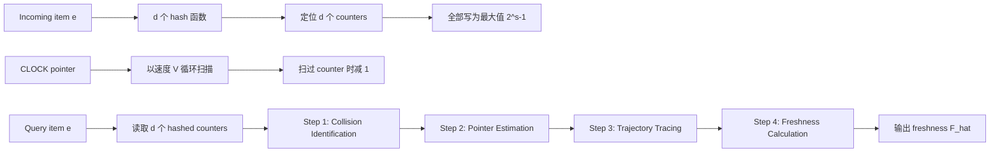

> **论文主题**：数据流中的 item freshness（条目新鲜度）估计  
> **核心方法**：RingSketch  
> **阅读定位**：面向数据流 / Sketch / 网络测量 / 推荐系统方向的博士生、硕士生与跨领域研究者

---

## 开头：论文发表信息、CCF 级别与开源情况

- **论文标题**：*Measuring Item Freshness in Data Streams*
- **作者**：Zirui Liu, Zihan Jiang, An Zhang, Zhouran Shi, Yuxuan Tian, Tong Yang
- **发表会议**：**KDD 2025（The 31st ACM SIGKDD Conference on Knowledge Discovery and Data Mining）**
- **发表时间与地点**：**2025 年 8 月 3–7 日，加拿大 Toronto**
- **论文 DOI**：https://doi.org/10.1145/3711896.3737044
- **CCF 级别**：**CCF A 类**。KDD/SIGKDD 位于 CCF“数据库 / 数据挖掘 / 内容检索”方向 A 类国际学术会议列表。
- **代码是否公开**：**是**。论文明确声明代码开源，GitHub 仓库当前可公开访问。
  - GitHub：https://github.com/RingSketch/RingSketch
  - Supplementary：https://github.com/RingSketch/RingSketch/blob/main/RingSketch_Supplementary.pdf
- **复现信息**：仓库提供 RingSketch、四个基线实现以及 freshness、cardinality、batch、periodic 等实验入口，作者称可复现实验结果。

> 💡 **先给结论**：这篇论文的真正创新并不是“又做了一个 Bloom/Clock 类结构”，而是把**循环 Sketch 的空间位置本身当成隐式时钟**：计数器值负责记录“完整转过多少圈”，指针位置负责恢复“当前这一圈走了多少”，两者拼起来得到细粒度时间。

---

## 1. 摘要 (Abstract) 与核心贡献 (Core Contribution)

### 一句话总结

**RingSketch 用一个持续旋转的 CLOCK 指针和多个小位宽计数器，在不显式存储 item ID 与 64-bit 时间戳的条件下，把“指针绕环运动的空间轨迹”转换成“距离上次出现的时间”，从而高精度、低内存地实时估计数据流中任意近期 item 的 freshness。**

### 贡献列表 (Contribution List)

- **首次系统定义并研究 item freshness**：将某个 item 的 freshness 定义为“当前时间与该 item 最近一次出现时间之间的间隔”，把它作为数据流中的独立测量属性进行研究。
- **提出 RingSketch 与 pointer tracing 技术**：将传统 time-agnostic sketch 与 CLOCK 式循环扫描结合，并通过**碰撞识别 + 历史指针位置估计 + 轨迹回溯**突破 ClockSketch/HyperBF 只能以整 epoch / 整圈为时间粒度的限制。
- **给出理论误差分析并进行系统实验验证**：无碰撞情况下平均绝对误差近似为 $T_0/(3d)$；实验上实现低于 $10^{-3}$ 量级的平均相对误差，同时更新吞吐超过 $11.4$ M/s，并显著优于四个改造后的基线。

---

## 2. 引言 (Introduction)：问题背景与研究动机

### 2.1 问题定义 (Problem Definition)

设数据流为

$$
\sigma = \{e_i\}_{i=1,2,\dots},
$$

每个到达元素带有时间戳 $t_i$。对于某个 item $e_i$，若其**最近一次出现时间**为 $t_i$，当前时刻为 $t_{now}$，论文定义：

$$
F_i = |t_{now}-t_i|.
$$

这里的 $F_i$ 就是 item freshness。

换句话说，论文解决的是：

> **在高速、无限长、item 数量很大的数据流中，如何用远小于“item 数量 × 时间戳大小”的内存，实时回答“某个 item 距离上次出现已经多久？”**

这个问题看似只是保存“last seen time”，但在大规模流式场景中非常昂贵。若直接使用哈希表，需要为每个 distinct item 保存：

1. item ID；
2. 最近到达时间；
3. 哈希表本身的 metadata / pointer / load factor 开销。

当 distinct item 达到百万、千万乃至更大规模时，这会迅速变成一个高内存问题。

论文给出的三个典型应用场景也很有代表性：

- **Cache / LRU**：freshness 本质上就是 recency，可用于近似 LRU 淘汰；
- **在线广告 / 推荐**：用户最近是否与某类商品发生交互，是行为兴趣动态变化的重要信号；
- **网络测量**：流的 freshness 可用于识别 active flow、flowlet、突发行为以及潜在攻击。

因此，这不是一个“纯理论 sketch 指标”，它对应的是**大规模系统中普遍存在的 recency / last-seen 查询**。

### 2.2 现有方法的局限 (Limitations of Prior Work)

论文指出，在它之前没有专门为 freshness estimation 设计的算法，因此只能把相邻问题中的方法“改造过来”。最相关的四类方案是 SWAMP、TOBF、HyperBF 和 ClockSketch。

#### 1）直接时间戳路线：TOBF

TOBF 为每个哈希位置直接保存时间戳。更新时把 $d$ 个位置写成当前时间；查询时从这些时间戳中推断上次出现时间。

**问题**：时间信息很精确，但存储昂贵。论文以典型 64-bit 时间戳为例，与 RingSketch 只使用小位宽 counter 的设计形成对比。

#### 2）epoch / 整圈路线：HyperBF、ClockSketch

这类方法不保存完整 timestamp，而是把时间离散化：

- HyperBF：用 epoch 编号表示时间；
- ClockSketch：指针每完成一整圈，就让 counter 衰减一次。

如果 counter 当前值为 $x$，那么只能得到类似

$$
\hat F = (2^s-1-x)\cdot \delta
$$

的估计。

这里的关键瓶颈是：**时间粒度被锁死在 epoch 长度 / 一整圈扫描时间 $\delta$ 上。**

也就是说，即使真实 freshness 是 2.13 秒和 2.89 秒，这类方案很可能都只能报告“2 个 epoch”或“3 个 epoch”。对 batch detection 这种“是否超过阈值”的二元任务，这个粒度可能够用；但对精确 freshness estimation 就明显不够。

#### 3）滑动窗口路线：SWAMP

SWAMP 可以维护近期 item 的 fingerprint 与频率等信息，但为了适配 freshness，需要额外存最近时间及相关 metadata，空间利用率不理想。

### 2.3 本文思路 (Overall Idea)

作者的突破点可以浓缩成一句话：

> **counter value 只能告诉我“过去了几整圈”，那就再利用 pointer 的当前位置，恢复“不满一圈的那部分时间”。**

这就是 RingSketch 名字中 “Ring” 的含义。

传统 ClockSketch 只看 counter 数值；RingSketch 进一步利用了整个环形数据结构的**几何位置**。它把一个 counter array 看成钟面：

- counter 值 = 粗粒度的“圈数”；
- pointer 的环上位置 = 细粒度的“相位”；
- 多个 hash 位置 = 对“item 到达瞬间 pointer 在哪里”的多点约束；
- pointer tracing = 把空间角度 / 距离转换成时间。

这使 RingSketch 从“时间离散桶”升级成了“粗粒度圈数 + 细粒度相位”的组合编码。

---

## 3. 方法论深度解析 (In-depth Methodological Analysis)

## 3.1 整体架构 (Overall Architecture)

论文图 1 给出最直观的 RingSketch 思想，图 2 则完整展示 update/query 的具体过程。

### 数据结构

RingSketch 使用一个长度为 $dm$ 的**循环 counter array**，并切分成 $d$ 个部分：

$$
\mathcal A_1,\mathcal A_2,\dots,\mathcal A_d,
$$

每个部分有 $m$ 个 $s$-bit counter，并绑定一个哈希函数 $h_i(\cdot)$。

一个 item $e$ 会被映射到 $d$ 个位置：

$$
\mathcal A_1[h_1(e)],\dots,\mathcal A_d[h_d(e)].
$$

另有一个 CLOCK pointer 以固定速度 $V$（counter / time unit）顺时针扫描整个环。

每扫过一个 counter，就把其值减 1。

若 $s$ 位 counter 的最大值是

$$
M=2^s-1,
$$

那么 pointer 完整扫一圈所需时间为

$$
T_0=\frac{dm}{V},
$$

而一个从最大值逐渐衰减到 0 的 counter 最多能保留的时间尺度为

$$
T=(2^s-1)T_0
=\frac{dm(2^s-1)}{V}.
$$

因此，$T$ 是 RingSketch 的**有效 freshness 观测窗口 / 最大保留尺度**。

### 整体数据流

### 更新路径：极简

如论文图 2(a) 所示，对 item $e$ 的 update 只有两件事：

1. 算 $d$ 次 hash；
2. 把 $d$ 个 counter 写成 $2^s-1$。

这使得高吞吐成为可能。

### 查询路径：复杂但信息利用充分

真正的算法创新集中在查询侧。作者刻意把 update 做得非常轻，把更复杂的推理留到 query：

1. 判断哪些 hashed counters 被别的更新覆盖；
2. 从剩余 counter 的值和环上相对位置推断“该 item 上次到达时 pointer 大致在哪”；
3. 沿环回溯 pointer 的历史轨迹；
4. 用“经过多少圈 + 圈内走了多远”恢复 elapsed time。

### 宏观设计上的不同

与 prior work 最大的宏观区别是：

- **ClockSketch / HyperBF**：时间只编码在 counter value 中；
- **RingSketch**：时间编码在 **counter value + counter spatial position + current pointer position** 中。

这相当于把原本被算法“浪费掉”的几何结构变成额外的信息通道。

---

## 3.2 核心组件/模块拆解 (Core Component Breakdown)

### 3.2.1 模块一：时间衰减式循环计数器

#### 输入与输出

- **输入**：流式 item $e$；
- **输出**：$d$ 个哈希位置的 counter 状态；
- **背景状态**：CLOCK pointer 的连续循环扫描。

#### 内部机理

item 到达时，所有 hashed counters 被“刷新”到最大值：

$$
\mathcal A_i[h_i(e)] \leftarrow 2^s-1.
$$

pointer 之后每扫过一次，就让 counter 减 1。于是 counter 的大小天然表示“距上次刷新大致经历了多少轮扫描”。

直观地说：

- counter 大：更 fresh；
- counter 小：更 stale；
- counter 变 0：旧时间信息被回收。

#### 设计动机

作者并不追求“所有历史 item 永久可查询”。相反，它明确采用一种 **freshness-aware memory allocation**：

> 越新的 item，尽量保留更多有效 hashed counters；越旧的 item，其 counter 更容易被新 item 覆盖，最终超过 $T$ 后被清空。

论文图 3 非常关键：在 CAIDA 上，fresh item 平均能保留接近全部 $d=4$ 个有效 counter，ARE 接近 0；随着 freshness 增大，有效 counter 数逐渐减少，误差随之上升。

这不是 bug，而是作者明确设计的“资源倾斜策略”。

---

### 3.2.2 模块二：Collision Identification —— 先判断哪些证据已经不可信

#### 输入与输出

- **输入**：查询 item 对应的 $d$ 个 hashed counters、它们在环上的位置、当前 pointer 位置；
- **输出**：一组 valid counters 与被判定为 collision-corrupted 的 invalid counters。

#### 内部机理

先取 $d$ 个 hashed counters 中的最小值：

$$
Min = \min_j c_j.
$$

论文把对应 counter 称为 **baseline counter**。若最小值有多个，则选择从当前 pointer 逆时针看距离更远的那个作为 baseline。

接下来分环的两个区间判断：

- 从当前 pointer 逆时针走到 baseline 的区间内：若某 hashed counter $> Min$，判作 collision；
- 从 baseline 继续逆时针走回当前 pointer 的另一区间内：若某 hashed counter $> Min+1$，判作 collision。

#### 为什么阈值是 $Min$ 和 $Min+1$？

这是理解算法的第一个关键点。

对**同一个 item、同一次刷新**而言，它的 $d$ 个 counters 都在同一时刻被设成最大值。但由于这些 counters 位于环上不同位置，pointer 在之后的扫描过程中可能：

- 已经扫过其中一些；
- 还没有扫过另一些。

因此，在没有碰撞时，同一 item 的有效 counters 的值**最多相差 1**。

而“到底应该是 $Min$ 还是 $Min+1$”，由 counter 相对于当前 pointer / baseline 的位置决定。

所以 collision identification 本质上是在检查：

> **这个 counter 的数值是否仍符合“同一批刷新、由同一个 pointer 扫描过程产生”的时空一致性？**

一旦 counter 大得“不合逻辑”，就说明它很可能后来被另一个更 fresh 的 item 重写了。

#### 设计动机

普通 Bloom/Sketch 碰撞通常只被视为噪声；RingSketch 则进一步利用**时间单调性 + 环上顺序**来识别一部分碰撞。

这也是它比直接“取最小 counter”更复杂、但更准确的原因。

---

### 3.2.3 模块三：Pointer Estimation + Trajectory Tracing —— 方法的核心创新

这是整篇论文最值得反复读的部分，对应论文图 2(b)–2(d)。

#### 输入与输出

- **输入**：valid hashed counters、baseline、当前 pointer 位置；
- **中间输出**：item 上次出现时的估计 pointer 位置；
- **最终输出**：pointer 自 item 上次到达至今的轨迹长度（以“圈数”计）。

#### Step A：估计上次到达时的 pointer 位置

从 baseline 出发，沿逆时针方向找到下一个 valid hashed counter。

作者把**两者的中点**作为 item 上次到达时 pointer 的估计位置。

若只剩一个 valid counter，则把其正对面的 180° 位置作为估计值。

这个设计其实是一个“区间中点估计”：

- baseline 与下一个 valid counter 给出了一个几何夹逼区间；
- 真实历史 pointer 位置落在该区间内；
- 不知道更多信息时，取 midpoint 可以最小化对称绝对误差。

#### Step B：回溯 pointer 轨迹

论文不是直接用 counter 值算时间，而是想象把 pointer 从当前时刻**逆时针倒放**：

- pointer 倒着扫过某个 valid counter 时，就把这个 counter 的值加 1；
- 一直倒放到估计的历史 pointer 位置；
- 直到 valid counters 恢复到它们被刷新时的状态 $2^s-1$。

这就是作者所谓的 **pointer tracing**。

#### 直觉

可以把每个 counter 想成一棵树上的“年轮记录器”：

- 每转完整一圈，相当于又长一圈年轮；
- 当前指针位置告诉你“这一圈长到哪里了”；
- counter 值说明已经过去多少完整周期。

因此，RingSketch 不只知道“几年”，还知道“这一年已经过了多少”。

---

## 3.3 关键公式与算法 (Key Equations and Algorithms)

### 关键公式 1：由“整圈 + 圈内距离”恢复 freshness

令：

- $s$：counter bit 数；
- $Min$：baseline counter 的值；
- $C$：当前 pointer 到估计历史 pointer 之间沿相应方向的 counter 距离；
- $dm$：整个环的 counter 总数；
- $T_0=dm/V$：pointer 转一整圈所需时间。

论文根据当前 pointer、baseline 与估计历史位置的相对顺序，给出两种 ring count：

$$
R = 2^s-2-Min + \frac{C}{dm},
$$

或

$$
R = 2^s-1-Min + \frac{C}{dm}.
$$

最终：

$$
\hat F_i = R\cdot T_0.
$$

#### 公式的目标

计算 item 从上次到达到现在，pointer 实际“等效走了多少圈”。

#### 各部分含义

- $2^s-1-Min$：大致代表已经发生的**完整衰减轮数**；
- $\frac{C}{dm}$：不足一整圈的**fractional phase**；
- 两个分支中的 “$-1$ 修正”来自 pointer 与 baseline 的相对位置：baseline 当前是否已经被这一轮 pointer 扫过，会导致其 counter 相差一次 decrement。

#### 公式的直觉

ClockSketch 只保留前半部分：

> “counter 从最大值掉了几次” = 过去了几整圈。

RingSketch 新增：

> “pointer 当前与历史位置差多远” = 当前这圈走了多少。

因此它把时间量化误差从“一个完整 $T_0$”压缩到“由 $d$ 个随机 hash 位置共同决定的局部区间”。

这就是精度跃升的来源。

---

### 关键公式 2：误差上界如何把“量化误差”和“碰撞误差”分开

论文 Theorem 4.2 给出单个近期 item 的期望绝对误差上界：

$$
\mathbb E(\Delta F_i)
\le
\frac{T_0}{3d}
+ (1-P)\cdot\frac{5T_0}{12d}
+ (1-P)^d\cdot\frac{T}{2},
$$

其中

$$
P=\left(1-\frac{1}{m}\right)^w \approx e^{-w/m}.
$$

这里：

- $w$：从该 item 上次出现到当前时刻之间出现过的 distinct item 数；
- $m$：每个 part 中的 counter 数；
- $d$：hash / part 数量；
- $T$：最大时间保留范围；
- $P$ 可以理解为某个 hashed 位置在这段时间里没有被这些后续 distinct item 撞到的概率量级。

#### 第一项：无碰撞情况下的“几何定位误差”

$$
\frac{T_0}{3d}
$$

这是 RingSketch 的内生误差，即使完全没有 hash collision，也仍然存在。

原因是：真实历史 pointer 位置通常位于两个有效 hash counter 之间，算法取 midpoint。随着 $d$ 增大，环上约束点更多，典型间隔更短，因此误差按 $1/d$ 缩小。

论文 Theorem 4.1 也直接给出：

$$
\mathbb E(E) \approx \frac{T_0}{3d}.
$$

这很好地说明了 pointer tracing 为什么有效：它把原来 $O(T_0)$ 的粗粒度误差进一步缩小到约 $O(T_0/d)$。

#### 第二项：部分 collision 造成的定位区间变宽

$$
(1-P)\cdot\frac{5T_0}{12d}
$$

当某些 hashed counters 被覆盖后，可用于夹逼历史 pointer 的有效点减少，估计区间变宽，因此误差增加。

#### 第三项：所有 $d$ 路证据都失效时的“大误差事件”

$$
(1-P)^d\cdot\frac{T}{2}
$$

这是最危险的一项：如果所有 hashed counters 都失去可信度，就可能产生接近整个时间窗口量级的误差。

这个公式揭示了 RingSketch 的核心 trade-off：

> **正常情况下误差非常小；真正危险的是“全部证据同时被碰撞覆盖”的低概率事件。**

因此增加 $d$ 的价值不仅是提高几何定位精度，也是在指数级降低“所有副本同时失效”的概率。

---

## 4. 实验设计与结果分析 (Experimental Design and Results Analysis)

### 4.1 实验设置 (Experimental Setup)

#### 硬件与实现

CPU 实验平台：

- Intel i9-10980XE，18 cores，4.2 GHz；
- 128 GB DDR4 3200 MHz；
- 24.75 MB L3 cache；
- 默认使用 32-bit BobHash，不同 seed 对应不同 hash functions。

RingSketch 默认参数：

- $d=4$；
- $s=16$；
- 开启 multi-threading acceleration；
- 开启 SIMD acceleration。

论文还指出：

- 可用 $d$ 个线程并行更新 $d$ 个 part；
- pointer 可独立线程扫描；
- 可使用 SIMD 一次衰减多个 counters。

#### 数据集

1. **CAIDA**
   - 网络 packet trace；
   - item ID 使用 13-byte 5-tuple；
   - 约 30M items，1.3M distinct items。

2. **Criteo**
   - 广告点击流；
   - 用 categorical features 的 hash 作为 ad/item ID；
   - 约 48M items，2.4M distinct items。

3. **Zipf synthetic stream**
   - 每组 32M items；
   - 用不同 $\alpha$ 控制数据倾斜度。

论文默认假设每个 time unit 到达一个 item，并只统计最近

$$
T=8192
$$

时间单位内出现过的 items。

#### Baselines

- SWAMP
- TOBF
- HyperBF
- ClockSketch

需要强调的是：这些基线**原本并不是专门为精确 freshness estimation 设计的**，作者按照第 2.2 节的方法进行适配并手动调参以获得较好精度。

#### Metrics

平均相对误差：

$$
ARE=\frac{1}{|\Psi|}\sum_{e_i\in\Psi}
\frac{|F_i-\hat F_i|}{F_i}.
$$

平均绝对误差：

$$
AAE=\frac{1}{|\Psi|}\sum_{e_i\in\Psi}|F_i-\hat F_i|.
$$

吞吐：Million operations per second（M/s）。

---

### 4.2 主实验结果 (Main Results)

### 结果一：Figure 6 —— 绝对误差显著降低

论文报告，相比 prior art，RingSketch 的 AAE 约降低 **13.5×–131.9×**。

以 **CAIDA + 128 KB** 为例：

| 方法 | AAE |
|---|---:|
| RingSketch | **2.4** |
| ClockSketch | 64.7 |
| TOBF | 41.9 |
| HyperBF | 32.3 |
| SWAMP | 316.6 |

#### 这验证了什么假设？

这个结果直接验证了作者的核心论点：

> **freshness estimation 的瓶颈不仅是 hash collision，更是时间粒度。**

如果问题只是 collision，那么 ClockSketch/HyperBF 在扩大 memory 后应该明显追近；但论文观察到 HyperBF 的误差对 memory 不敏感，因为它被 epoch length 主导。

也就是说，RingSketch 的收益不是简单来自“更多 counter”或“更好的 hash”，而是来自**对圈内相位的恢复**。

---

### 结果二：Figure 7 —— 相对误差优势更夸张

论文报告 RingSketch 的 ARE 相比 prior art 可降低 **13.3×–1899.1×**。

CAIDA + 128 KB：

| 方法 | ARE |
|---|---:|
| RingSketch | **$4.6\times10^{-4}$** |
| ClockSketch | $1.6\times10^{-2}$ |
| TOBF | $6.2\times10^{-3}$ |
| HyperBF | $8.8\times10^{-1}$ |
| SWAMP | $5.1\times10^{-2}$ |

这里尤其值得注意的是：**ARE 对 fresh item 非常敏感。**

如果真实 freshness 很小，哪怕只多错一个 epoch，relative error 都会被放大。因此 RingSketch 在 ARE 上取得极大优势，实际上正说明它成功解决了“细粒度 recent-time estimation”这个最困难的部分。

---

### 结果三：Figure 8 —— 高精度没有牺牲 update path

CAIDA + 128 KB 的 update throughput：

| 方法 | Update throughput (M/s) |
|---|---:|
| RingSketch | **11.4** |
| ClockSketch | 0.2 |
| TOBF | 3.1 |
| HyperBF | 3.4 |
| SWAMP | 7.4 |

论文报告 RingSketch 比 prior art 快约 **1.5×–57×**。

这看似反直觉：RingSketch 算法更复杂，为什么 update 反而快？

原因是作者把复杂性放到了 query：

- update：只 hash + set max；
- pointer decay：SIMD / 独立线程批量完成；
- 不写 64-bit timestamp；
- 不维护复杂 metadata。

因此它是一个典型的**read-compute-heavy / write-light** 设计。

---

### 结果四：Figure 9 —— Query 速度是明确代价

CAIDA + 128 KB 的 query throughput：

| 方法 | Query throughput (M/s) |
|---|---:|
| RingSketch | **7.1** |
| ClockSketch | 9.8 |
| TOBF | 12.4 |
| HyperBF | 10.0 |
| SWAMP | 13.7 |

RingSketch 比基线慢约 1.3×–1.9×。

作者也明确承认：原因是 RingSketch 查询时要执行 collision identification、位置判断和 pointer tracing。

因此该方法并非“各项指标全面免费提升”，而是：

> **用更复杂的查询逻辑，换取数量级更高的 freshness 精度，同时保持非常轻的更新路径。**

对于“写多读少”的高速流测量任务，这个 trade-off 通常非常合理；对于“查询密集”的 workload，则需要更谨慎评估。

---

### 4.3 消融实验 (Ablation Studies)

这里需要特别说明：**论文并没有提供严格意义上的模块级 ablation**，例如：

- RingSketch w/o collision identification；
- RingSketch w/o pointer tracing；
- RingSketch only counter value；
- RingSketch with exact historical pointer。

因此不能直接从实验中“因果分离”每个模块的贡献。

作者主要提供了三类替代证据。

#### 1）Figure 5：参数敏感性

**counter bits $s$**：$s$ 越大，ARE 越小；作者推荐 $s=16$，兼顾高精度与 SIMD 友好性。

**hash 数 $d$**：$d$ 增大通常降低 ARE，但吞吐显著下降。

论文给出的典型 update throughput：

- $d=4$：约 11.4 M/s
- $d=8$：约 5.9 M/s
- $d=12$：约 4.0 M/s
- $d=16$：约 3.0 M/s

query throughput 同样随 $d$ 增大而下降。

因此 $d=4$ 是作者选择的工程 sweet spot。

#### 2）Figure 3：有效 counter 数随 freshness 衰减

这个实验验证了“自动把更多空间留给 fresh items”的设计目标。

在 fresh 区域，item 保留接近 $d$ 个有效 counter，误差接近 0；越 stale，碰撞越多、有效 counter 越少、误差越大。

这与理论上 $P\approx e^{-w/m}$ 的直觉一致：距上次出现越久，中间见过的 distinct items 越多，counter 被覆盖概率越高。

#### 3）RingSketch vs. ClockSketch：可视为“非严格 ablation”

两者都使用循环计数器 + pointer 衰减，但 ClockSketch 只利用 counter value，而 RingSketch 进一步做 pointer tracing。

所以从结构差异上看，**最有可能贡献最大的是 pointer tracing / sub-cycle phase recovery**。

但需要保持科学表述：

> 这是基于结构对照和性能结果的强推断，而不是作者通过严格 ablation 直接证明的结论。

如果我是审稿人，我会要求作者补一组“RingSketch 去掉 pointer tracing”的对照，这会让核心创新的因果证据更干净。

---

### 4.4 具体实现细节

#### 1）内存、精度与时间窗口之间并非独立

有：

$$
T=\frac{dm(2^s-1)}{V}.
$$

因此四个参数存在强耦合：

- 更大 $m$：更多 counter，碰撞更少；
- 更大 $d$：更多冗余与更细定位，但 hash / query 成本更高；
- 更大 $s$：更多衰减状态；
- 更大 $V$：一圈更快、时间分辨率更高，但在 $m,s,d$ 固定时保留窗口 $T$ 变小。

所以不存在单独调一个参数就“无成本变好”。

#### 2）Table 3 的 pointer speed 结果要谨慎解释

作者发现 pointer 越快，ARE/AAE 越低。

但论文也明确指出：更快的 pointer 意味着**更小的 measurement window**，问题本身变简单了。

因此这个实验不能简单理解为“把 pointer 加速就能免费提高准确率”。

真正的关系是一个三角约束：

> **时间分辨率 - 最大 freshness 范围 - 内存容量**

三者需要共同配置。

#### 3）Hash function 对精度不太敏感，对吞吐敏感

附录 Table 2 比较 BobHash、MurmurHash、CityHash、FarmHash。论文观察到 ARE 基本接近，而更快的 hash 能显著提高 update throughput。

这说明 RingSketch 的核心精度机制主要来自结构与 pointer tracing，而不是某个特定哈希函数。

#### 4）多线程 / SIMD 是吞吐优势的重要工程组成

论文默认开启多线程和 SIMD。也就是说，11.4 M/s 不是纯算法伪代码的“自然常数”，它依赖具体优化。

复现时需要同时对齐：

- compiler；
- vectorization；
- thread placement；
- pointer scanning thread；
- CPU cache 行为。

---

### 4.5 扩展任务：为什么 freshness 是一个“中间层能力”

论文第 3 节后半和第 5.4 节进一步说明：一旦系统能准确回答 freshness，就可以复用到多个上层任务。

#### Fresh item cardinality

把 RingSketch 与 linear counting 结合。若窗口为 $T_c<T$，作者虚拟地把 pointer 往回转 $T_c$ 时间，并统计对应 counter 条件，使用：

$$
\hat C_i=-m\log\left(1-\frac{x_i}{m}\right),
$$

最后对 $d$ 个 part 取平均。

Figure 10 中，RingSketch 的 cardinality error 显著低于改造后的 HyperBF / TOBF；论文报告最高约 **100× 更小绝对误差、105× 更小相对误差**。

#### Variable-threshold batch detection

传统 batch detector 通常要求预先固定阈值 $T_b$。

RingSketch 先估计 freshness，再动态比较：

$$
\hat F(e) > T_b(e,t)?
$$

于是不同 item、不同时间可以使用不同 threshold。

Figure 11 中，5 KB memory 下 RingSketch 的 F1 接近 100%。

#### Periodic item mining

每次 item 到达时，先用 RingSketch 获取 interval $\hat F_i$，把

$$
E_i=\langle e_i,\hat F_i\rangle
$$

送入 top-$k$ sketch 统计高频周期模式。

Figure 12 中，RingSketch 方案 Recall / Precision 均超过 95%，优于 PeriodicSketch。

这说明作者真正想传达的一个更大观点是：

> **freshness 可以成为 streaming system 的基础 primitive，而不是某个单一应用的专用统计量。**

---

## 5. 讨论与思考 (Discussion and Reflection)

### 5.1 优点与创新点 (Strengths & Innovations)

#### 优点 1：把“空间结构”转化为“时间信息”，思路非常漂亮

论文最值得称道的不是某个复杂公式，而是一个非常简单但有普适性的观察：

> circular sketch 的 pointer position 本身就是一个 clock phase。

过去的 ClockSketch 只把 pointer 当作“后台清理线程”；RingSketch 把 pointer 的轨迹提升为**可被查询算法利用的一阶信息**。

这是一个典型的“已有系统组件中存在未利用信息”的创新。

#### 优点 2：算法-系统 co-design 做得好

更新路径极简、查询路径较重，是非常符合 streaming 系统的设计：

- 数据包 / 点击事件高速到达，update 是热路径；
- freshness query 可以相对少一些；
- pointer decay 可独立线程 + SIMD。

因此它不是纯理论 sketch，而是把 CPU 实现特性考虑进算法设计。

#### 优点 3：理论分析能对应到工程直觉

$T_0/(3d)$ 这个结果很有解释力：

- $T_0$ 控制一圈时间尺度；
- $d$ 控制空间采样密度；
- 误差就是“相位估计区间”的统计尺度。

Theorem 4.2 又把 collision 引入后分解成“基础定位误差 + 部分碰撞误差 + 全部失效的大误差事件”，与实际实现高度一致。

#### 优点 4：不只展示核心 benchmark，还验证了可迁移性

fresh cardinality、variable-threshold batches、periodic mining，以及附录中的 approximate LRU / recommendation system 都说明 freshness 不是一个孤立指标。

尤其附录中：

- LRU w/ RingSketch 的 hit rate 与标准 LRU 几乎一致（Zipf 1.2：83.91% vs 83.93%），同时作者报告 3.2× 更快 update、5.9× 更低空间；
- CAFE + RingSketch 的 Test AUC 从 72.123 提升到 72.231。

这为“freshness primitive”提供了较好的 end-to-end 证据。

---

### 5.2 局限性与可商榷之处 (Limitations & Debatable Points)

#### 局限 1：它并不是无限历史的“任意 item 精确 freshness”

论文在问题表述中说希望查询任意 item 的 freshness，但 RingSketch 的信息会在

$$
T=(2^s-1)T_0
$$

之后被清理。

所以严格来说，它真正高质量支持的是：

> **最近 $T$ 时间范围内出现过的 item。**

对远古 item，系统更像是“信息已过期 / stale beyond horizon”，而不是继续给出准确 freshness。

这与工程直觉完全合理，但在问题定义层面应该特别记住这一点。

#### 局限 2：方法明显偏爱 heavy-tailed / skewed stream

这是我认为最重要的限制之一。

附录 Table 4 显示，在固定 64 KB 下，Zipf skewness 越高，误差会快速下降；而理论部分也明确指出：在 uniform distribution 下，为获得强误差保证往往需要 $m>n$。

这意味着 RingSketch 的 sublinear-space 优势最适合：

- 有热点；
- 重尾；
- 最近活跃 item 相对集中

的数据流。

在近均匀、大基数、所有 item 都差不多活跃的流上，碰撞压力会明显上升。

值得注意的是，附录 Table 5 中 uniform case 虽然 RingSketch 仍优于其他方案，但和 ClockSketch 的差距已明显缩小（AAE 9.15 vs 12.09；ARE 0.0013 vs 0.0014）。

#### 局限 3：核心创新缺少最直接的模块级消融

论文最重要的 claim 是 pointer tracing，但没有展示：

- 同一个 RingSketch 数据结构；
- 保持参数和实现完全一致；
- 唯一去掉 pointer tracing；

会损失多少精度。

ClockSketch 是一个有说服力的外部对照，但不是严格 controlled ablation。

因此从“实验因果性”角度，证据还可以更干净。

#### 局限 4：实验把时间简化为“每 time unit 一个 item”

CAIDA 和 Criteo 原本都是真实时间数据，但论文实验中假设流以恒定速度到达：每个 time unit 一个 item。

这便于统一实验，但会弱化两个现实问题：

1. 流量 burst 时，单位真实时间内 distinct items 数 $w$ 激增，collision risk 会迅速上升；
2. pointer 是按 wall-clock 时间扫还是按 event 数扫，部署语义需要明确。

RingSketch 理论上可以按真实时间驱动 pointer，但如果要证明其网络 / 广告系统实用性，最好增加**非均匀 arrival-rate / bursty workload** 实验。

#### 局限 5：多线程正确性与工程细节仍略薄

论文说明可用多个线程更新 + 独立 pointer thread，但没有深入讨论：

- pointer decrement 与 update set-max 同时写同一 counter 时的原子性；
- cache coherence；
- false sharing；
- NUMA；
- memory ordering。

对真正高并发系统，这些细节可能决定最终吞吐与误差行为。

#### 局限 6：理论保证依赖哈希独立性与统计假设

数学分析建立在随机哈希、分布模型以及对 collision 的概率刻画上。

真实系统中可能出现：

- adversarial key；
- 哈希低位偏差；
- workload phase shift；
- sudden cardinality explosion。

这些都会让实际 collision pattern 偏离独立随机假设。

因此这篇论文的理论更适合理解**平均行为**，而不是 adversarial worst-case guarantee。

#### 局限 7：Figure 4 的理论曲线并不是严格精确模型

论文自己指出 Theorem 4.1 使用“$\approx$”而不是“$=$”，在 Zipf 1.5 的某些配置下实验 AAE 会超过所谓 no-collision theoretical curve。

这并不破坏论文主要结论，但提醒我们：

> 理论模型主要用于解释趋势和上界，而不是逐点预测真实误差。

---

### 5.3 未来工作与启发 (Future Work & Inspirations)

#### 方向 1：多尺度 RingSketch

现在只有一个 pointer speed $V$，因此存在单一时间分辨率 / 时间窗口 trade-off。

一个自然扩展是做多层 ring：

- fast ring：覆盖短窗口、超高分辨率；
- medium ring：覆盖中期历史；
- slow ring：覆盖长时间范围。

这类似时间域的 multi-resolution sketch，可以同时回答毫秒、秒、分钟尺度 freshness。

#### 方向 2：自适应 pointer speed

如果系统发现近期 arrival rate / distinct cardinality 急升，可以动态改变 $V$ 或 $T$。

难点在于：修改 $V$ 后，counter value 到真实时间的映射会改变，因此需要设计 time-warp / rescaling 机制。

这是一个很有潜力的在线自适应问题。

#### 方向 3：学习型碰撞识别，但保持无模型依赖 fallback

collision identification 目前基于硬规则：$Min$、$Min+1$ 和环上位置。

可以考虑：

- 用少量统计量预测某 counter 是否被覆盖；
- 但仍保留规则式 fallback；
- 避免像 learned filter 一样强依赖 stationary distribution。

这可能进一步提高 uniform / low-skew workload 下的有效 counter 数。

#### 方向 4：硬件实现

RingSketch 的操作模式非常硬件友好：

- 定址简单；
- counter 定长；
- update 是 set-max；
- background scan 是规律的顺序内存访问。

因此很适合研究：

- P4 programmable switch；
- SmartNIC；
- FPGA；
- GPU / SIMD-heavy stream processor。

如果能把 pointer scan 变成 line-rate pipeline，网络测量价值会更高。

#### 方向 5：从 freshness 推导更多 temporal primitives

这篇论文最重要的启发之一是：一旦有了低成本 last-seen estimate，还可以构建：

- recency-weighted heavy hitters；
- decay-aware frequency；
- active set membership；
- session / flowlet segmentation；
- temporal anomaly detection；
- cache admission + eviction joint policy。

也就是说，freshness 可能不是最终任务，而是**streaming temporal analytics 的基础中间表示**。

---

## 6. 我会如何向新入门学生解释这篇论文

如果只记住三句话，可以记：

1. **传统 Sketch 会数“多少”，RingSketch 试图测“多久没来”。**
2. **counter 数值告诉你走了几整圈，pointer 位置告诉你当前这圈走了多少。**
3. **它最强的地方不是完全没有碰撞，而是能识别部分碰撞，并让 fresh item 保留更多有效证据。**

从研究方法论角度，这篇论文值得学习的套路是：

> 找一个已有结构（CLOCK sketch）中“被忽略的内部状态”（pointer position），把这个状态重新解释成目标量（time）的编码，再围绕它设计恢复算法和误差分析。

这类创新往往比单纯堆复杂模型更优雅，也更容易形成理论与系统实现的统一。

---

## 7. 建议继续思考的几个问题

1. **如果 arrival rate 极度 bursty，固定速度 pointer 还能保持论文中的误差行为吗？**
2. **能否设计一个严格 ablation，定量分离 collision identification 与 pointer tracing 各自带来的收益？**
3. **多层不同速度的 rings 是否能解决短期高精度与长期大窗口之间的冲突？**
4. **当 stream 接近 uniform 时，怎样避免 $m>n$ 才有强保证的问题？**
5. **能否把 RingSketch 直接实现到 P4 / SmartNIC 上，让 freshness 成为 line-rate 网络测量 primitive？**
6. **如果查询工作负载远高于更新工作负载，是否值得缓存历史 pointer estimate 或设计 query-optimized 变体？**
7. **能否将 freshness 与 frequency 联合编码，在同一个 sketch 中同时回答“多频繁”和“多久没来”？**

---

## 8. 论文核心图表速查

| 图 / 表 | 你应该关注什么 | 对论文论点的作用 |
|---|---|---|
| **Figure 1** | RingSketch “年轮”式直觉 | 说明 counter + pointer trajectory 如何编码时间 |
| **Figure 2** | update + 三个 query 例子 | 全文最重要的方法图，理解 collision identification / pointer estimation / tracing |
| **Figure 3** | freshness vs 有效 counter 数 / ARE | 验证“优先给 fresh item 分配信息”的设计 |
| **Figure 4** | 理论 AAE 与实验 AAE | 验证理论趋势与上界 |
| **Figure 5** | $s,d$ 对 accuracy / throughput 的影响 | 给出参数 trade-off 与默认选择依据 |
| **Figure 6** | AAE 对比 | 验证细粒度时间估计优势 |
| **Figure 7** | ARE 对比 | 对 fresh item 的精度优势尤其明显 |
| **Figure 8** | update throughput | 说明热路径仍然高效 |
| **Figure 9** | query throughput | 明确展示查询复杂度的代价 |
| **Figure 10** | fresh cardinality | 展示 freshness 作为基础 primitive 的扩展性 |
| **Figure 11** | variable-threshold batch | 展示动态 threshold 能力 |
| **Figure 12** | periodic mining | 展示对上层 temporal pattern mining 的价值 |
| **Table 3** | pointer speed vs error | 暴露 resolution-window trade-off |
| **Table 4** | Zipf skewness vs error | 暴露方法对 heavy-tailed workload 的偏好 |
| **Table 5** | uniform distribution | 说明低 skew 下优势变小 |
| **Table 6–8** | LRU / recommendation | end-to-end 应用证据 |

---

## 9. 最终评价

这篇论文的价值主要体现在三个层面：

- **问题层面**：把 item freshness 明确抽象成一个独立 streaming primitive；
- **算法层面**：通过 pointer tracing，把循环 Sketch 的“空间相位”转成高精度时间信息；
- **系统层面**：更新路径轻、可 SIMD / 多线程化，并能迁移到 cache、cardinality、batch、periodic mining 与推荐系统。

如果把它与 ClockSketch 放在一起看，RingSketch 的关键进步可以概括为：

> **ClockSketch 把 CLOCK 当作衰减机制；RingSketch 把 CLOCK 同时当作衰减机制和时钟。**

它最适合的工作负载是具有明显热点、需要高速 update、关注近期 item freshness 的大规模数据流；而在 uniform、高查询强度、长历史保留或高度 bursty 的场景下，仍有进一步研究空间。

---

## 参考链接

- 论文 DOI：https://doi.org/10.1145/3711896.3737044
- RingSketch GitHub：https://github.com/RingSketch/RingSketch
- Supplementary：https://github.com/RingSketch/RingSketch/blob/main/RingSketch_Supplementary.pdf
- CCF 数据库 / 数据挖掘 / 内容检索方向会议目录：https://www.ccf.org.cn/Academic_Evaluation/DM_CS/
