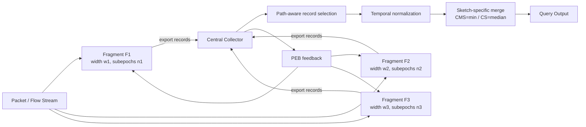

> **阅读定位**：这篇论文不是在设计一个“更好的单机 Sketch”，而是在回答一个更系统的问题：**当网络中每台交换机只能提供大小不同、且随时间变化的剩余 SRAM 时，如何把这些碎片化资源拼成一个可查询、可自适应、硬件可落地的网络级 Sketch？**
>
> 技术内容以用户提供的论文 PDF 为主；出版信息、CCF 级别与开放获取信息额外进行了公开信息核验。

---

## 开头：发表信息、CCF 级别与开源情况

- **论文题目**：*Spatiotemporal Sketch Disaggregation: Streaming Analytics with Heterogeneous Resources*
- **作者**：Jonatan Langlet, Peiqing Chen, Michael Mitzenmacher, Zaoxing Liu, Ran Ben Basat, Gianni Antichi
- **正式发表**：**IEEE 42nd International Conference on Data Engineering (ICDE 2026)**，论文集页码 **266–279**，在线出版时间为 **2026 年 5 月**。
- **DOI**：`10.1109/ICDE65706.2026.00027`
- **CCF 级别**：**CCF A 类**，归入“数据库 / 数据挖掘 / 内容检索”方向。ICDE 是该方向的 A 类国际会议。
- **预印本**：作者早期版本以 *Sketch Disaggregation Across Time and Space* 为题发布于 arXiv，编号 **arXiv:2503.13515**，首次提交于 2025 年 3 月。
- **开放获取论文**：
  - arXiv：https://arxiv.org/abs/2503.13515
  - 作者公开 PDF：https://langlet.io/assets/papers/DiSketch.pdf
  - DOI：https://doi.org/10.1109/ICDE65706.2026.00027
- **代码开源情况**：论文在 Section V 明确写道，作者提供了 **两个 open-source implementation**：一个模块化软件模拟器和一个面向 P4 可编程交换机的硬件原型。**但论文正文没有给出 DiSketch 自身的代码仓库 URL**；截至本笔记核验时，我也没有从公开检索结果中找到一个可以可靠确认属于这篇论文的 DiSketch 官方仓库，因此这里不猜测或杜撰链接。论文中唯一明确给出的 GitHub 地址是对比方法 Distributed Sketch 的官方实现，并非 DiSketch 本身。

> 📌 **一句定位**：这是一篇非常典型的“算法 + 网络系统 + 硬件实现”交叉论文，核心价值不只是提出 temporal sampling，而是把 **统计误差、异构资源、路径长度和 PISA 硬件约束**统一到了同一个设计里。

---

## 1. 摘要 (Abstract) 与核心贡献 (Core Contribution)

### 一句话总结

**DiSketch 将传统 Sketch 沿网络路径做空间上的 per-row 分解，再通过“子 epoch + 按 key 的时间采样”对每个碎片进行时间维度上的自适应稀释，使不同内存容量、不同负载的交换机碎片达到近似一致的误差水平，最终在控制端重新拼装为一个网络级虚拟 Sketch。**

### 贡献列表 (Contribution List)

- **提出 Spatiotemporal Sketch Disaggregation**：不仅把 Sketch 按空间拆成分布在多台交换机上的 fragment，还把每个 fragment 的时间窗口拆成多个 subepoch；每个 key 在每个 fragment 的一个 epoch 内只进入一个 subepoch，从而利用时间采样缓解小内存/高负载节点上的哈希碰撞。
- **设计网络级误差均衡机制 PEB Equalization**：从 Count-Min Sketch 与 Count Sketch 的经典误差界出发，定义 fragment 的 **Probabilistic Error Bound (PEB)**，每个节点根据自身计数器状态动态调节 subepoch 数量 $n$，让不同资源条件的 fragment 都向同一个 $\rho_{target}$ 收敛。
- **实现并验证系统 DiSketch**：将方法应用于 **Count Sketch、Count-Min Sketch、UnivMon**，并实现 Tofino 2/P4 硬件原型。实验显示，在频率估计上可在相同误差下约节省 **75% 内存**，或在相同内存下将误差降低接近 **一个数量级**；在 UnivMon 的熵估计上约可 **减半内存或减半误差**。

---

## 2. 引言 (Introduction)：问题背景与研究动机

### 2.1 问题定义 (Problem Definition)

Sketch 是流式数据分析中最经典的近似数据结构之一：用远小于完整流表的内存，近似回答 flow size、heavy hitter、entropy 等查询。在网络场景中，将 Sketch 放入 programmable switch，可以直接在数据平面处理经过的 packet，省去把全部流量送到服务器的成本。

但交换芯片的 line-rate SRAM 极其有限。论文指出，现代交换机通常只有数量级约 **10 MB** 的高速内存，而且这些 SRAM 还要和转发、安全、机器学习聚合、数据库加速等功能竞争。论文的 **Table I** 列出多类 in-network function 的 SRAM 消耗；**Fig. 2** 更直接说明：在真实 backbone trace 上做 heavy-hitter detection，若要达到 99% F1，一些 Sketch 可能已经消耗 Tofino SRAM 的 20% 到接近 90%。

因此，作者真正想解决的不是：

> “给我 512 KB，我怎样设计一个误差更低的 Sketch？”

而是：

> “网络路径上有多台交换机，每台只剩下不同数量的 SRAM，而且负载不同、路径长度也不同。我能不能把这些本来零散、难以利用的 residual resources 拼起来，得到一个比单点部署更好的网络级统计结构？”

这就是 **sketch disaggregation** 的问题。

### 2.2 现有方法的局限 (Limitations of Prior Work)

论文先讨论两种自然的空间拆分方向，见 **Fig. 3**。

#### 方法一：Per-column disaggregation

每台交换机保存 Sketch 的全部行，但只保存一部分列。

它在数学上很自然，因为多个 fragment 拼起来仍像一张更宽的矩阵。但网络实现很麻烦：一个 packet 到达某个 switch 时，switch 必须知道自己负责全局哪一段 column，以及沿路径总共有多少 column。已有方案往往需要维护 path/flow 到 fragment 的映射表。

论文指出，这种 lookup table 会快速膨胀；在 PISA/Tofino 上还会显著增加 TCAM 和计算资源开销。**Fig. 5** 表明 per-column 的硬件开销远高于 per-row。

#### 方法二：Per-row disaggregation

每个 fragment 直接占用本机全部 Sketch 内存，把自己看作一个独立的“Sketch row”。这种方式极其适合交换机：

- fragment 可完全自治；
- 不需要知道后续路径上的资源情况；
- 不需要 per-flow lookup table；
- 查询端再用 Count Sketch 的 median、Count-Min 的 min 等规则合并多行即可。

这也是 DISCO 的基本思路。

**问题在于：网络中的 row 并不“等价”。**

论文在 Section III 总结了三个关键异构性：

1. **内存异构**：不同 fragment 宽度 $w$ 不同，小 fragment 更容易发生 collision；
2. **负载异构**：不同交换机看到的 traffic volume 不同，同样大小的 fragment 在高负载节点上噪声更大；
3. **路径长度异构**：有些 flow 经过 5 个 fragment，有些只有 1 个。后者只有“一次独立重复”，天然更差。**Fig. 6** 清楚展示了 1-hop flow 比 3-hop/5-hop flow 更不准确。

所以，单纯“每个交换机放一行，然后 median/min”并不够。

### 2.3 本文思路 (Overall Idea)

作者的关键洞察是：

> **空间不足，不一定只能继续压缩空间；也可以缩短“同时观测的时间范围/Key 集合”，把时间当作第二个可分解维度。**

具体来说，一个内存很小或负载很高的 fragment 不必在整个 epoch 内同时承载所有 flow；它把 epoch 切成更多 subepoch，并通过 hash 让每个 flow 只在其中一个 subepoch 被记录。

例如：

- 大 fragment：$n=1$，整个 epoch 一直记录所有 key；
- 小 fragment：$n=8$，每个 subepoch 只记录约 $1/8$ 的 key；
- 因为每个 flow 在一个 epoch 内仍保证被记录一次，所以仍然可查询；
- 查询端再把“短时间观测”归一化并外推回整个 epoch。

这就是论文标题中的 **Spatiotemporal**：

- **Spatial**：不同交换机贡献不同 Sketch row；
- **Temporal**：每个 row 再按时间切成不同粒度的 subepoch。

---

## 3. 方法论深度解析 (In-depth Methodological Analysis)

## 3.1 整体架构 (Overall Architecture)

论文 **Fig. 1** 给出了宏观流程：网络拓扑状态与可用资源进入 disaggregation engine，Sketch fragments 被部署到不同节点；packet 在线经过这些节点时，各 fragment 更新自己的统计；subepoch 结束后记录被收集到中心；查询时进行 re-aggregation。

下面是按 Fig. 1、Fig. 7、Fig. 8 重画的概念流程：



核心不是“把同一种 Sketch 简单分布式部署”，而是构造了一个闭环：

$$
\text{本地负载与内存}
\rightarrow \text{估计误差}
\rightarrow \text{调整 subepoch 数 } n
\rightarrow \text{改变采样比例}
\rightarrow \text{新的误差}
$$

这使 DiSketch 具有 **self-tuning** 特征。

### 数据流的完整过程

1. 全局时间被划分为 epoch $E$；
2. fragment $F$ 将 epoch 划分为 $n_E^F$ 个等长 subepoch；
3. 对 key $\kappa$，通过 fragment-specific hash：

$$
s_E^F(\kappa) \in \{0,1,\ldots,n_E^F-1\}
$$

决定它在这个 fragment 的哪个 subepoch 被监控；
4. subepoch 结束后导出记录：

$$
R=(F,E,S,n,c,h)
$$

其中 $c$ 是 counters，$h$ 是该轮使用的 hash 信息；
5. 控制端根据 query key 的路径和 hash，找出真正监控过该 key 的 records；
6. 不同 fragment 的 $n$ 不同，因此记录覆盖的时间长度不同，先统一到同一时间粒度；
7. 在每个统一 subepoch 上使用原 Sketch 的聚合规则（Count-Min 用 min，Count Sketch 用 median）；
8. 对没有任何记录覆盖的 temporal blind spot 做外推；
9. 对所有标准化 subepoch 求和，得到 epoch 级估计。

### 宏观设计上与 prior work 的本质区别

DISCO 主要做的是：

$$
\text{一个 Sketch 的多行} \Rightarrow \text{分散到路径上的多个节点}
$$

DiSketch 进一步变成：

$$
\text{空间上的多行} \times \text{时间上的自适应采样粒度}
$$

因此它不要求每个 fragment 拥有相同容量，也不要求每个节点看到相同流量。**异构不再被视为必须消除的异常，而成为控制变量 $n$ 的输入。**

---

## 3.2 核心组件/模块拆解 (Core Component Breakdown)

### 3.2.1 模块一：Subepoching —— 用时间维度“扩容”小 fragment

论文 **Fig. 7** 是理解全文最重要的一张图。

```mermaid
flowchart TB
    E[Epoch E] --> F1[Fragment F1: n=1\n整段时间监控]
    E --> F2[Fragment F2: n=4\n每个 key 只落入一个 subepoch]
    E --> F3[Fragment F3: n=8\n每个 key 只落入一个 subepoch]

    K[Key κ] --> H1[s_E^F1(κ)]
    K --> H2[s_E^F2(κ)]
    K --> H3[s_E^F3(κ)]
    H1 --> F1
    H2 --> F2
    H3 --> F3
```

#### Input & Output

**输入**：

- key $\kappa$，如 5-tuple flow ID；
- epoch $E$；
- fragment 当前 subepoch 数 $n_E^F$；
- 当前时间戳。

**输出**：

- 当前 packet 是否应更新本 fragment；
- subepoch 结束时的 record $R$。

#### Internal Mechanism

对于 fragment $F$：

$$
s_E^F: \kappa \rightarrow \{0,1,\ldots,n_E^F-1\}
$$

同一个 key 在同一 epoch、同一 fragment 中只映射到一个 subepoch。因此，若 $n=8$，平均每个 subepoch 只需要承载约 $1/8$ 的 keys。

这会显著减少哈希碰撞，因为在 Sketch 宽度 $w$ 不变时，进入该结构的总频率质量下降了。

关键点是：**作者不是随机丢包，而是对 key 做时间分片。**

如果做 packet sampling，某个小 flow 可能一个 packet 都采不到；而这里每个 key 都保证在 epoch 内拥有一个被监控的时间片。因此它保留了“每个 key 可查询”的性质。

#### Design Rationale

为什么不直接做“每台交换机随机选择一部分 flow 永久监控”？

因为独立的 flow sampling 可能导致某条 flow 在路径上的所有 fragment 都没有被选中，形成不可恢复的 coverage hole；而且不同 flow 的精度会随机分化。

subepoching 的巧妙之处是把 coverage 从“是否被选中”改成“在哪个时间片被选中”。

换句话说：

> **空间采样容易让 key 消失；时间采样让 key 只暂时消失。**

---

### 3.2.2 模块二：PEB Error Equalization —— 把“异构容量”转换成“异构采样率”

如果所有 fragment 固定使用相同 $n$，仍然无法解决异构：

- 小内存 + 高流量节点仍然比大内存 + 低流量节点更吵；
- median/min 聚合时，某些 row 的信息质量远低于其他 row。

因此作者为每个 fragment 构造一个可在线估计的误差尺度 $\rho$，称为 **Probabilistic Error Bound (PEB)**。

#### Input & Output

**输入**：本 epoch 中每个 subepoch 的 counter vector $c$、fragment width $w$、网络级目标 $\rho_{target}$。

**输出**：下一个 epoch 使用的 subepoch 数 $n_{E+1}$。

#### Internal Mechanism

直觉非常简单：

- 如果当前 fragment 噪声太大：把 epoch 切得更细，即增加 $n$；
- 如果当前 fragment 很宽裕：减少 $n$，让每个 key 被观察更长时间；
- 目标是让所有 fragment 的局部误差处在同一个数量级。

因此，DiSketch 真正均衡的不是“内存”或“流量”，而是 **最终用于聚合的 row quality**。

#### 为什么“误差均衡”比“内存均衡”更合理？

因为 Sketch 的精度并不只由 $w$ 决定，还由进入该 row 的总频率质量决定。

例如两个 64 KB fragment：

- 一个处理 1 Mpps；
- 一个处理 10 Mpps；

它们显然不应采用同样采样策略。

PEB 相当于把“内存容量 + traffic load”压缩成一个统一控制信号。

---

### 3.2.3 模块三：Central Querying —— 把不等长的时间碎片重新拼回一个 epoch

论文 **Fig. 8** 展示查询端的过程。这部分是方法里最容易被低估、但实际上决定正确性的组件。

#### Input & Output

查询定义：

$$
Q=(\theta,\tau,\kappa)
$$

其中：

- $\theta$：查询类型，如 flow frequency；
- $\tau=[T_{start},T_{end})$：查询时间窗口；
- $\kappa$：目标 key。

输入是所有 fragment 导出的 subepoch records；输出是整个 query window 的估计。

#### Step 1：筛选真正相关的 records

先根据流路径 $P_\kappa$ 过滤 fragment，再计算每个 fragment 中：

$$
S=s_E^F(\kappa)
$$

从而只取那些真的采样过 $\kappa$ 的 subepoch record。

这里隐含一个重要系统假设：**控制端知道或能够重建 flow path**。论文认为在 ECMP 下可通过 hash 重算、路由状态或 INT telemetry 获得。

#### Step 2：时间归一化

假设一条 flow 路径上有多个 fragment：

- $F_1$ 用 $n=2$；
- $F_2$ 用 $n=4$；
- $F_3$ 用 $n=8$。

取：

$$
n_m=\max_R R.n=8
$$

然后把覆盖更长时间的 record 拆成多个统一长度的虚拟片段。

若 record $R$ 的 subepoch 数为 $R.n$，则：

$$
N_R=\frac{n_m}{R.n}
$$

它的原始估计 $O_R$ 被均分为：

$$
O'_R=\frac{O_R}{N_R}
$$

然后对每个标准化 subepoch，把所有可用 fragment 的估计用原 Sketch 规则合并：

- CMS：minimum；
- CS：median。

最后把所有标准化 subepoch 的估计求和，得到完整 epoch 的结果。

#### Temporal Blind Spot

因为某个标准化 subepoch 可能没有任何 fragment 在该时段采到目标 key，所以会产生 blind spot。

作者采用一个非常朴素的补法：

> 用其他已有 subepoch 的平均值填补缺失时间片。

这也是论文最重要的统计假设来源：**flow rate 在一个较短 epoch 内相对稳定**。

一旦 flow 极度 bursty，平均值外推就会偏离真实值。

---

## 3.3 关键公式与算法 (Key Equations and Algorithms)

### 3.3.1 公式一：PEB 的来源与直觉

#### Count-Min Sketch

经典 CMS 中，目标 key $\kappa$ 的 counter 会被其他 key 的哈希碰撞抬高。若 row 宽度为 $w$，论文给出的概率界为：

$$
\Pr\left[
\hat f_\kappa-f_\kappa
\ge 4\frac{\sum_{j\in K}f_j}{w}
\right]
\le \frac14.
$$

因此作者把 CMS 的局部噪声尺度定义为：

$$
\rho_{CMS}=\frac{\sum_{j\in K}f_j}{w}.
$$

直觉：

- 流量总量越大，collision noise 越大；
- row 越宽，collision 越少；
- 所以误差尺度正比于“单位 counter 承担的总频率质量”。

#### Count Sketch

Count Sketch 的误差更接近二阶矩：

$$
\Pr\left[
|\hat f_\kappa-f_\kappa|
\ge 2\sqrt{\frac{\sum_{j\in K}f_j^2}{w}}
\right]
\le \frac14.
$$

所以定义：

$$
\rho_{CS}=\sqrt{\frac{\sum_{j\in K}f_j^2}{w}}.
$$

这里最重要的不是常数 2 或 4，而是：**作者从 Sketch 自己的误差理论中提取出一个可以用于系统控制的“误差强度”指标。**

实际交换机不知道真实 $f_j$，所以用 counter 近似：

$$
\hat\rho =
\begin{cases}
\sqrt{\frac{\sum_{i=1}^{w}c_i^2}{w}}, & \text{Count Sketch}\cr
\frac{\sum_{i=1}^{w}c_i}{w}, & \text{Count-Min Sketch}
\end{cases}
$$

并对一个 epoch 内所有 subepoch 求平均：

$$
\hat\rho_E=\frac{1}{n_E}\sum_{s=0}^{n_E-1}\hat\rho_{E,s}.
$$

### 3.3.2 公式二：$n$ 的闭环控制律

论文的核心控制规则是：

$$
n_{E+1}=
\begin{cases}
2n_E, & \hat\rho_E>2\rho_{target}\\
\max(1,n_E/2), & \hat\rho_E<\rho_{target}/2\\
n_E, & \text{otherwise}
\end{cases}
$$

#### Objective

让不同 fragment 的：

$$
\hat\rho_E \approx \rho_{target}
$$

即让最终参与网络级查询的各行具有相近噪声尺度。

#### 为什么采用“乘 2 / 除 2”而不是精确求解？

一方面，作者要求 $n$ 是 2 的幂，便于 P4 数据平面通过时间戳 bit slice 直接判断 subepoch；另一方面，渐进式调整比每轮根据一个 noisy $\hat\rho$ 直接重算 $n$ 更稳定，避免单个 outlier 造成剧烈振荡。

这是一个非常系统化的设计：**数学误差界、离散控制器和硬件位运算实现是相互配合的。**

### 3.3.3 关键权衡：$\rho_{target}$ 不是越小越好

论文明确指出总误差近似为：

$$
\epsilon
=
\epsilon_{subepoch}
+
\epsilon_{extrapolation}
\approx
\rho+
\epsilon_{extrapolation}.
$$

降低 $\rho_{target}$ 会迫使 fragment 增加 $n$：

- 好处：每个 subepoch 中参与竞争的 keys 更少，Sketch collision noise 下降；
- 坏处：每个 key 被真正观察的时间更短，需要更强的时间外推，burstiness error 上升。

所以最优点不是无限小的 $\rho$，而是一个 bias/variance 式的折中。

作者给出的工程解法是：先用 warm-up epoch（如 $n_{max}=32$，暂时关闭 temporal sampling）估计每个 counter 的 subepoch 增量波动：

$$
\mu_i=\frac1n\sum_{s=1}^{n}\Delta c_{i,s},
$$

$$
\sigma_i^2=\frac{1}{n-1}\sum_{s=1}^{n}(\Delta c_{i,s}-\mu_i)^2,
$$

再取：

$$
\sigma_{net}=\mathrm{median}_i\{\sigma_i\}.
$$

最后通过合成流量离线标定：

$$
\rho^*(\sigma)=\arg\min_{\rho\in \mathcal R}\mathrm{Err}(\rho;\sigma),
$$

部署时令：

$$
\rho_{target}\leftarrow \rho^*(\sigma_{net}).
$$

这一步很工程化，但也暴露了论文的一个理论缺口：**$\rho_{target}$ 仍然是依赖 workload calibration 的超参数。**

---

## 4. 实验设计与结果分析 (Experimental Design and Results Analysis)

### 4.1 实验设置 (Experimental Setup)

#### 数据与流量

论文使用 **CAIDA NYC Equinix 2019 backbone trace**。默认实验回放约：

- 5 秒流量；
- 约 2M packets；
- 约 200K flows。

由于原始 trace 来自单条 backbone link，作者将 IP 地址随机映射到模拟拓扑中的 hosts，用于生成 network-wide communication。这一点在后面的局限性中非常重要：它不等价于真实数据中心的空间流量分布。

#### 网络拓扑

评估两类典型数据中心结构：

- Fat-Tree（20 switches，包含 4 个 core switches）；
- Spine-Leaf（12 switches）。

#### 内存分布

- **Homogeneous**：所有 switch 分配相同 base memory；
- **Heterogeneous**：随机生成不同 fragment size，默认 Gini = 0.4。论文给的一个 5 节点示例是：

$$
[10\%,30\%,100\%,160\%,200\%]
$$

相对于 base memory 的比例。

#### 被评估的 Sketch

- Count Sketch → DiSketch-CS；
- Count-Min Sketch → DiSketch-CMS；
- UnivMon → DiSketch-UM（16 levels）。

#### Baselines

1. **Aggregated Sketch**：传统的单点/核心交换机聚合部署；
2. **DISCO**：典型 per-row disaggregated sketch；
3. Distributed Sketch 主要用于硬件资源对比，而没有进入完整 accuracy comparison，因为作者认为其 per-flow lookup table 无法扩展到实验中的全部 flow 数量。

#### Metrics

- Frequency estimation：RMSE；
- 异构性实验：NRMSE；
- Entropy estimation：relative entropy error；
- 硬件：SRAM、TCAM、Hash Dist、sALU、VLIW instructions 等资源占用。

---

### 4.2 主实验结果 (Main Results)

### 4.2.1 Fig. 12：频率估计

**Fig. 12** 是论文最核心的性能图：三个 Sketch × 两种拓扑 × homogeneous/heterogeneous memory，横轴为 base memory，纵轴为 RMSE。

结论非常一致：DiSketch 基本在所有配置下都优于 Aggregated 与 DISCO。

一个论文特别强调的例子来自 heterogeneous Fat-Tree：

- DiSketch-CS：平均每交换机 **128 KB** 时就可实现 **RMSE < 1**；
- DISCO-CS：需要大约 **512 KB** 才达到相近水平。

也就是说，同等精度下内存约减少：

$$
1-\frac{128}{512}=75\%.
$$

若把内存固定为 512 KB：

- Aggregated CS：RMSE = **460**；
- DISCO-CS：RMSE = **0.8**；
- DiSketch-CS：RMSE = **0.09**。

仅比较 DISCO 与 DiSketch：

$$
\frac{0.8}{0.09}\approx 8.9,
$$

接近 **一个数量级误差下降**。

#### 这验证了什么假设？

它验证的并不是“subepoching 本身一定更准”，而是：

> **当 fragment row 的容量和负载不一致时，先通过时间采样把每行的有效 collision level 拉回相近区间，再进行 row aggregation，比直接聚合质量悬殊的 rows 更有效。**

尤其值得注意的是，收益在 heterogeneous case 中仍然稳定，说明 PEB equalization 确实击中了作者声称的核心痛点。

### 4.2.2 Fig. 13：UnivMon 熵估计

Fig. 13 不再只看 per-flow frequency，而是评估 network-wide IP entropy。

结果是：

- DiSketch-UM 达到与 DISCO-UM 相近 entropy error 时，约只需要 **一半内存**；
- 或在相同内存下，将 entropy error 约降低 **50%**。

这个结果很重要，因为它说明方法不是“只为 flow-size estimator 特制”。UnivMon 是多层 Count Sketch 组成的通用测量框架，DiSketch 可以保留每个 level 并统一使用 subepoch mapping。

---

### 4.3 消融实验 / 机制验证 (Ablation Studies)

严格来说，这篇论文**没有提供深度学习论文常见的逐组件 ablation table**，例如：

- 去掉 subepoching；
- 保留 subepoching 但去掉 PEB equalization；
- 去掉 query normalization；
- 去掉 burstiness-based $\rho_{target}$ 初始化。

因此不能把论文实验过度解读为已经完全分离了每个组件的独立贡献。

不过，有三组实验可以视为“机制级消融”。

#### 机制验证一：Fig. 14 —— 异构程度对收益的影响

作者分别改变：

- load heterogeneity；
- width/memory heterogeneity；

范围 CoV = 0 到 1.8。

右侧 heatmap 展示 DiSketch 相对 DISCO 的 $\log_{10}(NRMSE)$ 改善。结果是：**几乎所有组合都改善，而且异构越强，改善一般越明显。**

这恰好验证了 PEB equalization 的设计目标：DISCO 是 heterogeneity-unaware，而 DiSketch 会根据 fragment 自己的误差动态调整 $n$。

值得肯定的是，作者没有回避异常现象：他们指出“load heterogeneity 增大反而看起来变好”很可能是实验构造造成的 artifact，因为只评价 full-path flows、总 background traffic 固定；把背景负载集中到少数节点，反而让其他 fragment 更干净。这种自我质疑增强了实验可信度。

#### 机制验证二：Fig. 16 —— Single-hop mitigation

路径越长，可聚合的独立 rows 越多，因此 disaggregated sketch 自然更准。

在 1 MB base memory 时，论文观察到 single-hop flow 的误差约是 3-hop flow 的 **50×**；8 KB 时差距约 **2.8×**。

作者于是给 single-hop flow 每 epoch 两次采样：

$$
S_{E,0}=s_E(\kappa),
$$

$$
S_{E,1}=s_E(\kappa)+\frac{n_E}{2}\pmod{n_E}.
$$

结果：

- 8 KB 时 single-hop error 降低约 **24%**；
- 1 MB 时降低约 **13%**；
- 代价是其他 multi-hop flow 因为额外 counter increments 而略有退化。

这说明 single-hop mitigation 有效果，但不是决定整体优势的核心模块。**真正贡献最大的是 subepoching + PEB equalization 所形成的异构适配机制。**

#### 机制验证三：Fig. 11 —— 硬件结构开销

这是“系统可行性消融”。Distributed Sketch 依赖 per-flow lookup table，TCAM 随 flow 数近似线性增长；论文报告其官方 pipeline 在单 stage TCAM 约只能容纳 1K flows，即使不考虑 stage 限制，也会在约 6K flows 时耗尽 TCAM。

DiSketch 则没有 per-flow table，额外开销主要是固定的 Hash Distribution 和 VLIW instruction；增加 flow 数量或精度主要增加 SRAM，而不会同步膨胀 TCAM。

这验证了作者从一开始选择 **per-row + local autonomous fragment** 而不是 per-column 的硬件动机。

---

### 4.4 具体实现细节

论文 Section V 的实现非常值得系统方向读者仔细看，因为它体现了“算法必须长得像硬件能做的样子”。

#### Tofino 2 原型

- 目标硬件：**Tofino 2**；
- 交换容量：论文描述为最高 **6.4 Tbps**；
- 代码量：约 **850 LOC**，分布在 P4 data plane 与 Python control plane。

#### 如何在数据平面判断当前 subepoch？

论文 **Fig. 9** 的技巧很漂亮：epoch length 和 $n$ 都限制为 2 的幂。

这样可以直接从 switch internal timestamp 中 bit-slice：

- 低 $\log_2(T_E)$ 位表示 epoch 内时间偏移；
- 其中较高的 $\log_2(n)$ 位就对应当前 subepoch 编号。

没有除法，没有浮点，没有复杂 timer。

#### 如何判断某个 flow 是否在当前 subepoch 被选中？

1. 对 flow ID 用硬件原生 CRC8 hash；
2. 与 epoch 内 timestamp 做 XOR；
3. 检查结果最高 $\log_2(n)$ 位是否全为 0；
4. 用一个 single-entry ternary match table 完成 bitmask 匹配。

因此 $n$ 的变化只需要更新 bitmask。

#### 数据平面与控制平面的边界（Fig. 10）

- **ASIC**：packet-level sketching、subepoch identification、flow-to-subepoch mapping；
- **CPU/control plane**：epoch transition、计算新 $n$、导出记录。

为了避免数据平面做 counter reset，控制端读 raw counter，并与上一次值相减获得 delta。

这种分工相当合理：

> 高频、简单、确定的工作放 ASIC；低频、复杂、自适应的工作放 CPU。

#### Collection overhead

subepoching 会提高导出频率。论文报告实际 $n$ 通常收敛到个位数，常见约 $n\approx5$，因此 records 数约增加 5 倍。

作者估算：若 epoch 约 1 s、每交换机 100 ms 导出一次，在 1000-switch 网络中约为 **10,000 records/s**。他们认为相对现代 telemetry collector 的处理能力仍然很小。

但这一点更像 capacity argument，而不是完整 end-to-end collector benchmark，后文会再讨论。

---

## 5. 讨论与思考 (Discussion and Reflection)

### 5.1 优点与创新点 (Strengths & Innovations)

#### 1. 把“时间”真正作为 Sketch disaggregation 的资源维度

论文最漂亮的思想不是简单 sampling，而是把“可用内存不足”转化为“每个时间片只承载一部分 key”。

这实际上改变了传统 Sketch 的设计空间：

$$
\text{Accuracy}=f(\text{memory})
$$

扩展为：

$$
\text{Accuracy}=f(\text{memory},\text{temporal sampling},\text{path redundancy}).
$$

当网络天然提供多 hop 冗余时，这种时空拆分非常有力量。

#### 2. Error equalization 比 resource equalization 更高级

很多资源调度工作会试图让每个节点“分到一样多内存”或“承担一样多流量”。DiSketch 的视角更接近统计估计问题：真正需要接近的是 **row 的误差质量**。

这是一个可迁移的思想：在异构分布式系统中，不必追求资源同质，而应追求“输出质量同质”。

#### 3. 从理论边界一路落到 P4 bit operation

论文的方法不是先设计一个理想算法，再试图硬塞进 switch；相反：

- $n$ 选 2 的幂；
- 控制律采用 $\times2/\div2$；
- subepoch 从 timestamp bit slice 得到；
- membership 用 CRC + XOR + ternary mask；
- 复杂配置只在 epoch 边界由 CPU 完成。

这是非常典型的 hardware-aware algorithm design。

#### 4. 不局限于单一 Sketch

Count Sketch、Count-Min、UnivMon 都能套入框架，说明核心抽象是“独立 row/repetition + 可合并的累计统计”，而不是特定 estimator 的技巧。

---

### 5.2 局限性与可商榷之处 (Limitations & Debatable Points)

### 1. 最核心的统计假设：时间外推依赖局部平稳性

作者自己给出：

$$
\epsilon\approx \rho+\epsilon_{extrapolation}.
$$

所以 DiSketch 并没有消灭误差，而是把一部分 collision error 换成了 temporal extrapolation error。

如果一个 flow 的 packet 在 epoch 内高度 bursty，并且恰好 burst 发生在没有被观测的 subepoch，那么“用其他时间片平均值补 blind spot”可能非常差。

这意味着方法的优势取决于一个 workload property：**短时平稳性 / burstiness**。

### 2. $\rho_{target}$ 仍缺少强理论闭环

论文用 synthetic workload 建立：

$$
\sigma_{net}\mapsto \rho^*
$$

这是一种很实用的 calibration，但它并没有证明该映射在真实 workload shift 下仍然最优。

作者在 Discussion 中也承认，如何理论刻画最优 $\rho_{target}$、甚至消除这个 hyperparameter，是重要 future work。

### 3. 路径知识是一个“被弱化但没有消失”的依赖

fragment 在在线 packet processing 时不需要知道完整路径，这是很大的优点；但**查询端**仍需要知道 $P_\kappa$。

当 flowlet switching、failure rerouting 或动态 ECMP 使一条 flow 在一个 epoch 内改变路径时，简单地选择一组固定 fragments 可能产生 bias。论文给出讨论，但没有系统实验覆盖这些快速路径动态。

### 4. 真实流量的空间映射有限

实验使用 CAIDA 单链路 backbone trace，再随机映射 IP 到数据中心 hosts。这样可以复现真实 packet arrival sequence，却无法完整复现数据中心中：

- locality；
- rack-level skew；
- elephant/mice 在拓扑中的空间相关性；
- application-driven burst pattern。

作者自己在 Fig. 14 的解释中承认某些 load heterogeneity 现象可能是实验 artifact，这是一个值得重视的边界。

### 5. 网络规模与完整硬件部署仍有限

仿真拓扑只有几十台 switches。作者说明单个数据点需要接近一小时计算，并测试过约 2 倍规模没有明显趋势变化；这个说明有合理性，但仍不能完全替代大规模 topology / traffic matrix 的系统验证。

硬件部分证明了单交换机 pipeline feasibility 和资源成本，但论文没有展示一个大规模多 Tofino 集群中从 packet update、同步导出、collector reaggregation 到 query latency 的完整 end-to-end benchmark。

### 6. collection overhead 的论证偏“容量可承受”，不等于“系统无痛”

约 $5\times$ 的 export record 增长在吞吐量上可能确实不大，但实际系统还需要考虑：

- record burst synchronization；
- controller polling/read latency；
- PCIe/CPU contention；
- 多 tenant telemetry 共存；
- collector memory footprint；
- query freshness。

论文目前没有深入覆盖这些 tail effect。

### 7. 缺少更干净的模块级消融

如果要更强地证明机制，我希望看到：

1. DISCO；
2. DISCO + fixed subepoching；
3. fixed subepoching + normalization；
4. adaptive $n$ without burstiness calibration；
5. full DiSketch。

这样才能更清楚地区分“时间采样本身”和“PEB controller”分别贡献多少。

---

### 5.3 未来工作与启发 (Future Work & Inspirations)

#### 方向一：让 $\rho_{target}$ 在线自优化

把 $\rho_{target}$ 看成在线控制/决策变量，而不是离线 synthetic calibration 的 lookup table。

例如可考虑：

- contextual bandit；
- Bayesian optimization；
- MPC；
- 根据 query error feedback 的 stochastic control。

目标是自动学习：

$$
\rho_{target}^*(\text{burstiness, load, memory, path length}).
$$

#### 方向二：设计“协同但不需要显式路径表”的时间采样

目前各 fragment 独立 hash，可能形成 temporal blind spot。一个有趣方向是设计 **弱相关/负相关的 subepoch assignment**：保证同一 flow 在路径上不同 fragment 更均匀地覆盖不同时间区间，同时仍然不需要 per-flow state。

这可能显著降低 extrapolation error。

#### 方向三：动态路径下的 path-uncertain querying

可以把路径从确定集合 $P_\kappa$ 扩展成：

$$
\{(P_i,p_i)\}
$$

即多个可能路径及其概率，再对 fragments 做加权融合；或者利用 INT / postcards 只对发生 reroute 的 flow 保留轻量路径证据。

#### 方向四：扩展到 Bloom Filter / HyperLogLog / 非累加估计器

论文 Discussion 已提到这一点。

真正值得研究的是：什么数据结构满足“spatiotemporally disaggregatable”？可能需要一个形式化条件，例如：

- local fragment estimator 可独立计算；
- spatial merge 是 associative/robust aggregation；
- temporal merge 可做 additive 或近似 additive reconstruction；
- sampling 后仍存在可控误差界。

如果能给出这样的统一理论，论文的思想就会从“一个系统技巧”升级成“一类分布式 streaming data structure 的设计范式”。

#### 方向五：联合资源调度

现在 DiSketch 假设“有多少 residual memory，就拿多少”。更进一步可以联合调度：

- firewall；
- telemetry；
- in-network ML；
- congestion control；
- sketch fragments。

让系统根据业务 SLA 自动在多个 in-network function 之间分配 SRAM，并把 DiSketch 的 $\rho$ 作为可优化的 accuracy utility。

---

## 进一步值得追问的几个问题

1. **如果 flow 在一个 epoch 内呈现极端 ON/OFF burst，DiSketch 在什么 burstiness 阈值后会输给 DISCO？** 论文给了 heuristic，但没有给出非常清晰的相变边界。
2. **能否让不同 fragment 的 subepoch hash 具有覆盖互补性，理论上最小化 temporal blind spot？** 这可能是下一步最自然的算法问题。
3. **PEB equalization 是否实际上在近似一种“最小化最大 row error”的 min-max optimization？** 如果是，可以建立更系统的优化理论。
4. **路径越长越准是否会造成 measurement fairness 问题？** 数据中心中 rack-local flow 往往很多，而它们恰恰可能是 single-hop，如何保证不同 path length 的统一 SLA？
5. **如果 query window 不与 epoch 对齐，如何支持 arbitrary interval query？** 当前论文假设 query window 由连续 epochs 构成，这对一些交互式 telemetry workload 可能偏强。
6. **在真实多交换机硬件环境中，collection jitter 与 epoch clock skew 会不会破坏 temporal normalization？** 论文的 bit-sliced timestamp 很高效，但跨设备时间一致性值得单独评估。

---

## 总结：我会如何评价这篇论文？

这篇论文最值得学习的地方，不是某个具体公式，而是一条非常完整的科研逻辑链：

> **观察现实约束：交换机 SRAM 小且异构**  
> $\Downarrow$  
> **分析已有 disaggregation 为什么在异构环境失效**  
> $\Downarrow$  
> **把时间维度引入资源分解**  
> $\Downarrow$  
> **用 Sketch 误差理论构造可反馈的 PEB**  
> $\Downarrow$  
> **用简单离散控制让 fragment 自适应**  
> $\Downarrow$  
> **设计可在 PISA 上用 bit/hash/mask 实现的 dataplane**  
> $\Downarrow$  
> **通过异构性、路径长度、硬件资源、不同 Sketch 查询验证假设**

从研究创新性来看，**“空间分解 + 时间采样 + 误差均衡”这一组合是论文真正的核心**；从系统价值来看，最大的亮点是它没有为了漂亮的理论结果牺牲交换芯片可实现性。

如果把它当作博士生阅读范例，我尤其建议学习两点：

1. **不要只优化资源本身，要寻找直接决定输出质量的中间量。** DiSketch 选择的是 PEB，而不是 SRAM 大小。
2. **硬件约束可以反向塑造算法形式。** $n$ 必须是 2 的幂、用倍增/减半控制，并不是数学上唯一的选择，但它让算法真正能在高速数据平面落地。

因此，我会把这篇论文视作一篇相当“系统味”的 Sketch 工作：它并没有发明新的基础 Sketch，而是改变了 **Sketch 应该如何跨节点、跨时间使用资源** 的方式。

---

### 参考链接

- ICDE 2026 论文 DOI：https://doi.org/10.1109/ICDE65706.2026.00027
- arXiv 预印本：https://arxiv.org/abs/2503.13515
- 作者公开 PDF：https://langlet.io/assets/papers/DiSketch.pdf
- CCF 推荐目录入口：https://www.ccf.org.cn/Academic_Evaluation/By_category/
