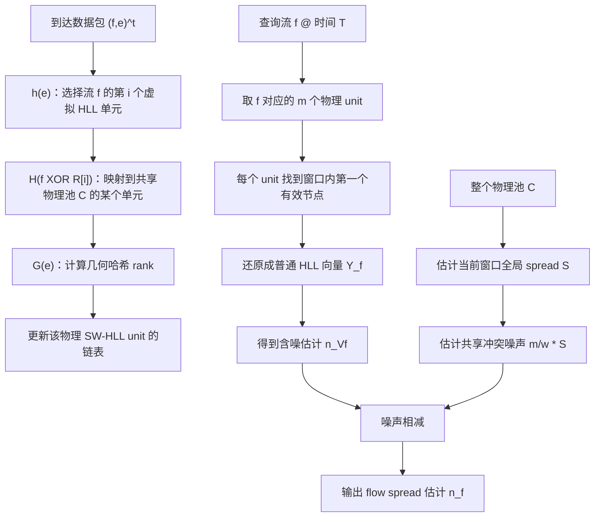

> **论文作者**：Michael Hentz, Aayush Karki, Haibo Wang  
> **主题关键词**：Flow Spread、Sliding Window、HyperLogLog、Sketch、Network Measurement  
> **阅读定位**：面向刚进入网络测量 / 数据流算法方向的博士生、硕士生或跨领域研究者，重点理解“为什么要从 Bitmap 换成 HLL”“滑动窗口如何让 HLL 支持过期删除”“多流共享内存后如何处理噪声”。

---

## 开头：论文发表信息、CCF 级别与开源情况

- 📅 **发表时间与会议**：论文发表于 **2024 年第 1 届 IEEE International Conference on Meta Computing（ICMC 2024）**，会议于 2024 年 6 月 20–23 日在中国青岛举行；论文收录于会议论文集第 250–258 页，DOI 为 `10.1109/ICMC60390.2024.00034`。
- 🏷️ **CCF 级别**：截至 2026 年第七版《中国计算机学会推荐国际学术会议和期刊目录》，**ICMC 未列入 CCF A/B/C 推荐会议目录，因此没有 CCF A/B/C 等级**。需要强调，CCF 自身也说明该目录是“推荐列表”，并不等同于对单篇论文质量的评价。
- 💻 **是否开源**：论文正文没有给出代码仓库地址；按论文标题、方法名 **SWVHLL**、作者姓名等进行公开检索，也**未找到作者公开的 SWVHLL 官方实现仓库**。因此目前更稳妥的结论是：**未发现公开源码**，而不是断言“作者绝对没有开源”。
- 🔗 **公开信息链接**：
  - DOI：https://doi.org/10.1109/ICMC60390.2024.00034
  - University of Kentucky 论文元数据页：https://scholars.uky.edu/en/publications/a-hyperloglog-based-solution-to-measuring-sliding-window-flow-spr/
  - CCF 推荐目录：https://www.ccf.org.cn/Academic_Evaluation/By_category/

> **一个值得提前注意的编辑问题**：论文引言声称在“uniform noise subtraction”基础上进一步提出了“ranged noise estimation and subtraction”，但在本文提供的 9 页版本中，核心算法与公式只明确给出了 **uniform noise calculation and subtraction**（式 (6)）。后文会专门讨论这一点。

---

## 1. 摘要 (Abstract) 与核心贡献 (Core Contribution)

### 一句话总结

**这篇论文解决的是“如何在高速、内存受限的网络设备上，对大量流在任意滑动时间窗口内的去重元素数（flow spread）进行高效估计”，核心方案是把 Sliding HyperLogLog 的寄存器虚拟化并共享到一个公共物理池中，再通过全局噪声估计进行校正。**

论文将一个到达数据包抽象为二元组 $(f,e)$：$f$ 是流标识，$e$ 是需要去重统计的元素标识。若把目的 IP 当作 $f$、源 IP 当作 $e$，那么某个目的 IP 的 spread 就代表最近窗口内访问它的不同源 IP 数量，可用于 DDoS 相关检测。

### 贡献列表 (Contribution List)

- **提出 SWVHLL（Sliding Window Virtual HyperLogLog）**：把原本面向单流、固定窗口的 HLL 思路扩展到**多流 + 滑动窗口**场景，并通过“virtual sketch + shared physical pool”让大量流共享内存。
- **设计滑动窗口 HLL 单元**：把一个普通 HLL register 扩展为按几何哈希值组织的带时间戳链表，使窗口滑动后能够找到“当前窗口内仍然有效的最大 rank”，从而避免传统 HLL 无法删除过期元素的问题。
- **在 CAIDA 骨干网真实流量上验证**：与唯一针对该问题的先前方法 VATE 相比，SWVHLL 在 10/20/40 MB 内存下平均绝对误差分别降低约 **33.5% / 50.3% / 64.0%**；查询速度显著更快，但在线记录吞吐低于 VATE。

---

## 2. 引言 (Introduction)：问题背景与研究动机

### 问题定义 (Problem Definition)

论文研究的是 **FS-SW：Flow-Spread estimation in the Sliding Window**。

对每个到达数据包，定义：

$$
(f,e)^t
$$

其中：

- $f$：flow label，例如源 IP、目的 IP、五元组的某种组合；
- $e$：element ID，需要统计“不同值”的字段，例如对端 IP、端口等；
- $t$：时间戳或到达序号。

对于流 $f$，其在某个测量区间内的 spread 为：

$$
n_f = |\{e \mid (f,e)^t \text{ 位于当前窗口内}\}|
$$

也就是：**当前窗口内，属于流 $f$ 的不同元素个数**。

论文区分了两个窗口模型：

1. **固定窗口（fixed window）**：时间轴被切成互不重叠的区间，只在窗口边界查询时能够完整对应“最近 $N$ 个时间单位”。
2. **滑动窗口（sliding window）**：在任意时刻 $T$，窗口始终对应最近 $N$ 个时间单位：

$$
(T-N,\,T]
$$

滑动窗口更符合在线安全监控、流量工程等场景，因为现实任务通常关心“最近一分钟”“最近五分钟”，而不是某个固定对齐的分钟段。

### 为什么这件事重要？

论文给出的典型应用包括：

- DDoS 检测：目的 IP 为流，源 IP 为元素，spread 大意味着很多不同源访问同一目标；
- 扫描检测：源 IP 为流，目的 IP/端口为元素，spread 大可能意味着扫描器；
- 广告点击去重：广告为流、用户为元素；
- 社交平台话题热度：话题为流、用户为元素。

真正困难的不是“一个流的 distinct count”，而是：

> **同时维护十万级甚至更多流的 distinct count，并且窗口每秒都在滑动，还要在 SRAM 等小而快的内存中运行。**

论文提到现代路由器/交换机高速缓存资源有限，而网络流量中又可能在几分钟内出现 $10^5$ 量级的主机，因此“每个流单独分配一个独立估计器”在空间上不可行。

### 现有方法的局限 (Limitations of Prior Work)

#### 2.1 固定窗口方法：时间边界不自然

传统 flow-spread sketch 多数针对固定窗口。最大问题并不一定是估计器本身不准，而是**时间模型不匹配**：

- 一个真实的“最近 60 秒”查询可能横跨两个固定窗口；
- 如果只使用当前固定窗口，旧窗口中仍应保留的流量会被遗漏；
- 如果合并多个固定窗口，又会把已经过期的流量带进来。

所以即使固定窗口内部估计很准，也会产生**窗口切割误差**。

#### 2.2 VATE：Bitmap 的动态范围在小内存下容易饱和

论文认为此前唯一直接针对多流滑动窗口 spread 的方法是 **VATE**。VATE 的基本思想是：

- 维护一个共享时间戳数组；
- 每个流映射到若干虚拟 Bitmap 位；
- 某个位对应时间戳若落在当前滑动窗口内，则视为“1”；
- 再用 Bitmap 的 distinct-count 公式估计 spread。

Bitmap 的经典估计公式为：

$$
\hat n = -m\ln\left(1-\frac{U}{m}\right)
$$

其中 $m$ 是 Bitmap 位数，$U$ 是置 1 的位数。

问题在于，当 $U/m$ 接近 1 时，Bitmap 接近饱和，估计非常敏感。论文图 1 用 5000-bit Bitmap 展示：在高占用率后，估计值出现明显“压平”。论文认为实际可靠范围大约在 95% 位被置 1 之前，此时：

$$
\hat n \approx -m\ln(0.05) \approx 3m
$$

因此，一个只有 $m$ 位的 Bitmap，其可用动态范围大体只有 $O(m)$ 量级；而流 spread 或全局 distinct 数可能达到百万、十亿量级。

> 🔎 **小的公式勘误**：论文第 4 页文字将 95% 占用对应的式子排成了类似 $-m\ln(1-0.05)$，但若 95% 位为 1，应代入 $U/m=0.95$，即 $-m\ln(1-0.95)=-m\ln 0.05\approx3m$。结合其数值 15000 可以判断，这是排版/书写问题而不是算法含义变化。

### 本文思路 (Overall Idea)

作者的切入非常直接：

> **既然 VATE 的根本瓶颈来自 Bitmap，那么把底层 distinct-count estimator 换成动态范围更大的 HLL；然后再解决 HLL 在滑动窗口下无法“删除过期最大值”的问题；最后通过虚拟化让大量流共享一个 HLL 单元池。**

这形成三层逻辑：


这也是理解整篇论文最关键的“问题 → 方法”主线。

---

## 3. 方法论深度解析 (In-depth Methodological Analysis)

## 3.1 整体架构 (Overall Architecture)

论文的完整处理流程可以概括为：



这里有三个非常重要的参数：

- $m$：**每个流的虚拟 HLL register 数**，实验中固定为 128；
- $w$：**共享物理 SW-HLL unit 池的大小**；
- $b$：HLL register 的位宽，实验中为 5。

### 核心思想

SWVHLL 的核心不是简单“把 HLL 放进滑动窗口”，而是两个技术的叠加：

1. **时间维度的可过期化**：用链表保留“将来可能成为最大 rank 的候选历史值”；
2. **流维度的虚拟化**：每个流只拥有逻辑上的 $m$ 个 register，实际 register 从公共池中通过哈希映射得到。

与“每流一个完整 SW-HLL”相比，第二步把空间复杂度从“流数 × 每流 sketch”变成“固定共享池 + 哈希冲突噪声”。本质上，这是经典 virtual sketch 思想在 sliding-window HLL 上的实现。

---

## 3.2 核心组件/模块拆解 (Core Component Breakdown)

### 3.2.1 组件一：SW-HLL Unit —— 让 HLL 支持滑动窗口过期

#### 输入和输出

**输入**：映射到某个 HLL register 的新元素 $e$、到达时间 $t$、其几何哈希值 $G(e)$。  
**输出**：一个按 rank 组织、携带时间戳的候选链表。

普通 HLL register 只保存：

$$
M[i] = \max \{G(e)+1\}
$$

这对固定窗口完全够用，因为只关心“历史最大值”。

但在滑动窗口里，当前最大值对应的元素一旦过期，必须知道**第二大、第三大……候选值中谁仍在窗口内**。普通 HLL 已经把这些历史信息丢掉了，因此无法恢复。

#### 内部机理

论文图 2 把每个 HLL register 扩展成一个链表单元（SW-HLL unit）。每个节点保存：

- `reg`：几何哈希 rank；
- `time`：该 rank 最近被记录的时间；
- `next`：下一个候选节点。

更新规则可抽象为：

> 从链表头开始，找到第一个 `reg <= G(e)` 的节点；用当前 $(G(e),t)$ 替换它，并删除它之后的全部节点。如果整条链上都没有 `reg <= G(e)`，则把新节点追加到尾部。

这会维持一个很关键的不变量：

- 从头到尾，`reg` 递减；
- 较靠前的是“更大的历史 rank”；
- 新数据如果 rank 较小，会作为更晚的备用候选保留下来。

举例：假设一个 unit 当前为

$$
(9,t_1) \rightarrow (6,t_2) \rightarrow (3,t_3)
$$

此时新来一个 $G(e)=7$：

- 9 比 7 大，保留；
- 6 不大于 7，因此用 $(7,t)$ 替换 6；
- 后面的 3 不再可能成为必要候选，直接删掉。

最终：

$$
(9,t_1) \rightarrow (7,t)
$$

为什么 3 可以删？因为 7 比 3 大且比 3 更新。未来只要 7 仍在窗口中，3 永远不可能成为该 register 的最大有效 rank；等 7 过期时，3 必然更早过期，因此也没有价值。

这是一种非常典型的**单调候选结构**思路，与维护滑动窗口 maximum 的 monotonic queue 具有相似直觉。

#### 查询机制

在查询时刻 $T$，窗口是 $(T-N,T]$。从链表头向后找第一个满足：

$$
T-N < \text{node.time} \le T
$$

的节点，把它的 `reg` 作为当前窗口内该 HLL register 的值。

为什么“第一个有效节点”就是正确的？因为链表按 rank 递减，而在它之前的更大 rank 节点都已经过期；因此该节点正好是**当前窗口中最大的有效 rank**。

#### 设计动机

作者没有直接存储窗口内全部元素，也没有周期性重建 HLL，而是只保留“将来可能成为 register 最大值”的候选。这相当于把滑动窗口删除问题转化为一个**候选最大值维护问题**。

论文进一步给出 Theorem 1：该链表扩展不会额外引入 distinct-count 误差；在同一窗口、相同哈希和参数下，它查询时恢复出的 register 与对应固定窗口 HLL 的 register 相同。

> **需要注意**：这个定理只说明“SW-HLL 的时间窗口机制不会额外损失 HLL 信息”，并不证明后续“多流共享 + 噪声相减”的最终估计无偏。

---

### 3.2.2 组件二：Virtual SW-HLL —— 多个流共享一个物理池

#### 输入和输出

**输入**：流标识 $f$、元素 $e$、时间 $t$。  
**输出**：对共享物理池 $C$ 中某个 SW-HLL unit 的一次更新。

论文图 3 是整篇论文最关键的结构图：每个流看起来都有一个长度为 $m$ 的虚拟 SW-HLL，但这些虚拟 register 实际映射到长度为 $w$ 的公共物理池 $C$。

#### 三个哈希函数的分工

对于数据包 $(f,e)^t$：

1. **$h(e)\in[0,m)$**：决定元素 $e$ 更新流 $f$ 的哪一个虚拟 register；
2. **$H(f\oplus R[h(e)])\in[0,w)$**：把这个虚拟 register 映射到共享物理池 $C$ 中；
3. **$G(e)$**：生成 HLL 的几何 rank。

因此物理位置是：

$$
C\left[H\left(f\oplus R[h(e)]\right)\right]
$$

其中 $R[0],...,R[m-1]$ 是随机种子数组。

对某个固定流 $f$，它的虚拟 sketch 实际由以下 $m$ 个物理 unit 构成：

$$
C[H(f\oplus R[0])],\ C[H(f\oplus R[1])],\ldots,C[H(f\oplus R[m-1])]
$$

#### 为什么虚拟化有效？

作者依赖的是网络流量常见的**重尾/偏斜分布**：绝大多数流很小，只有极少数流很大。

论文 Table I 就非常典型：

| Spread 范围 | Flow 数量 | 平均 spread |
|---|---:|---:|
| $(0,10]$ | 166,366 | 1.34 |
| $(10,10^2]$ | 2,875 | 25.8 |
| $(10^2,10^3]$ | 492 | 304.2 |
| $(10^3,10^4]$ | 27 | 2,352.8 |
| $(10^4,10^5]$ | 3 | 12,763.0 |
| $(10^5,10^6]$ | 1 | 144,742.0 |

这意味着给每个小流都分配 128 个独占 unit 非常浪费；共享可以显著提高内存利用率。

代价当然是：**不同流会哈希到相同物理 unit，于是查询某个流时会混入其他流的数据。** 这正是下一模块要解决的 noise。

---

### 3.2.3 组件三：共享噪声估计与相减

#### 输入和输出

**输入**：

- 流 $f$ 的虚拟 sketch 产生的含噪 HLL 估计 $\hat n_{V_f}$；
- 当前窗口整个流量的全局 spread 估计 $\hat S$；
- 虚拟 sketch 大小 $m$ 与物理池大小 $w$。

**输出**：校正后的流 spread $\hat n_f$。

#### 内部机理

由于每个流只映射到物理池的 $m$ 个位置，若假设其他流的元素在 $w$ 个单元上近似均匀分布，那么一个流的虚拟 sketch 接收到的全局噪声比例大约为：

$$
\frac{m}{w}
$$

因此论文使用：

$$
\boxed{
\hat n_f = \hat n_{V_f} - \frac{m}{w}\hat S
}
$$

其中：

- $\hat n_{V_f}$：从该流映射到的 $m$ 个 unit 恢复出的 HLL sketch 所估计的 cardinality；
- $\hat S$：把整个物理池 $C$ 在当前滑动窗口内恢复为一个 HLL sketch 后得到的全局 cardinality；
- $\frac{m}{w}\hat S$：按照均匀占用假设分摊到该虚拟 sketch 的“背景噪声”。

#### 设计动机

这与 virtual sketch 家族中的典型做法一致：

> **共享空间本身不是问题，只要能够统计共享导致的平均污染，并在查询时扣除。**

空间效率和精度之间因此形成可控交换：

- $w$ 越大：冲突越少，噪声越小，但内存更多；
- $m$ 越大：每流 HLL 本身精度更高，但映射到更多物理 unit，也可能占用更多共享资源；
- $m/w$ 是一个直接反映“单流虚拟视图占整个池比例”的量。

#### 我对这一模块的关键理解

这里是整篇论文**最值得审视、也是理论最薄弱**的地方。

“均匀噪声”假设并不能完全描述真实的 HLL 冲突，因为 HLL register 保存的是 **max rank**，污染不是简单的线性计数叠加：一个噪声元素只有在 rank 足够大时才会改变 register。于是直接从 cardinality 估计中减去 $(m/w)\hat S$ 是一个实用近似，而不是严格从 HLL 的极值统计分布推导出的无偏校正。

论文实验显示它有效，但并没有给出最终估计的无偏性证明或显式误差界。

---

## 3.3 关键公式与算法 (Key Equations and Algorithms)

### 3.3.1 HLL 的基准估计公式

论文把普通 HLL 作为底层 cardinality estimator。用标准形式写，可以表示为：

$$
\hat n
=
\alpha_m\frac{m^2}{\sum_{i=0}^{m-1}2^{-M[i]}}
$$

其中：

- $m$：HLL register 数量；
- $M[i]$：第 $i$ 个 register 中记录的最大几何 rank；
- $2^{-M[i]}$：将 rank 映射回与 cardinality 相关的尺度；
- $\alpha_m$：偏差校正常数。

#### 公式的目标

根据“极端哈希事件出现的频率”反推不同元素个数。

#### 数学直觉

如果只出现少量不同元素，很难出现“很多前导零”的哈希结果，因此 register 值普遍较小；如果不同元素很多，就更容易观测到稀有的大 rank。

HLL 不存元素本身，而只存“我见过多极端的哈希值”，因此能以极小空间估计很大的 cardinality。这正是作者选择它替代 Bitmap 的根本原因。

---

### 3.3.2 SWVHLL 的噪声校正式：论文真正的核心公式

论文式 (6)：

$$
\boxed{
\hat n_f = \hat n_{V_f} - \frac{m}{w}\hat S
}
$$

#### Objective：它到底在优化什么？

它不是训练意义上的“损失函数”，而是**查询阶段的解析纠偏公式**，目标是在共享内存引入污染后恢复目标流本身的 spread。

#### Meaning of Terms

- $\hat n_f$：最终输出的 flow $f$ spread；
- $\hat n_{V_f}$：目标流的虚拟 HLL 看到的总 cardinality，里面既有目标流，也有哈希碰撞进入的其他流；
- $\hat S$：当前窗口内整个数据流的 distinct cardinality；
- $m/w$：目标流虚拟 sketch 占整个物理池的比例。

#### Intuition

如果全局共有 $S$ 个 distinct 元素，并且它们被均匀撒到 $w$ 个物理 unit，那么任意 $m$ 个 unit 平均会接收：

$$
\frac{m}{w}S
$$

规模的背景污染，于是把它从目标流的含噪估计中减掉。

#### 一个必须追问的问题

严格来说，$\hat S$ 中也包含目标流自身元素，而 $\hat n_{V_f}$ 中目标流元素的保留方式又经过 HLL 的 max 聚合，因此“直接线性相减”并非显然严格成立。论文没有给出此式的误差界，这使它更像一个经验上有效的估计器。

---

### 3.3.3 Algorithm 1：在线记录过程的真正本质

论文 Algorithm 1 的伪代码看起来较长，但可以压缩成以下逻辑：

```text
for each packet (f,e)^t:
    i   = h(e)                          # 选择虚拟 register
    pos = H(f XOR R[i])                 # 映射到物理 unit
    g   = G(e)                          # HLL rank

    从 C[pos] 链表头开始：
        找第一个 reg <= g 的节点

    若找不到：
        把 (g,t) 追加到尾部
    否则：
        用 (g,t) 覆盖该节点
        删除它之后的全部节点
```

它实际上维护的是一个**按 rank 单调递减的“时间候选前沿”**。

对于 $b=5$，rank 的取值范围很小，所以单个链表长度具有常数上界；论文因此把更新和查询视为近似常数开销。

---

## 4. 实验设计与结果分析 (Experimental Design and Results Analysis)

### 实验设置 (Experimental Setup)

#### 数据集

论文使用 **CAIDA 美国骨干网 60 分钟真实流量 trace**：

- 总数据包数：约 **1.32 billion**；
- flow label：目的 IP；
- element ID：源 IP；
- 每分钟约 **170k** 个不同 flow；
- 论文报告约 **600k** 个 distinct elements；
- 滑动窗口：**1 分钟**；
- 时间粒度：**1 秒**。

此时一个目的 IP 的 flow spread 表示最近一分钟内与它通信的不同源 IP 数。

#### 硬件与实现

- CPU：Intel Core i7-8700 3.2 GHz；
- 内存：16 GB；
- SWVHLL 与 VATE 均为 CPU 实现；
- SWVHLL：$m=128$，$b=5$；
- 时间戳采用论文借鉴 VATE 的 compact timestamp（AT），实验中 $k=7$ bit。

#### 评价指标

论文声明使用两类指标：

1. **精度**：average absolute error、relative bias；
2. **性能**：recording throughput、per-flow query processing time。

不过最终正文展示的主要精度结果是 **average absolute error**，并没有看到完整的 relative-bias 表格或曲线。这是实验报告完整性上的一个缺口。

#### 基线

核心基线只有一个：**VATE**。论文的理由是 VATE 是此前唯一直接解决“多流 flow spread + sliding window”的工作。

这使对比非常聚焦，但也意味着实验广度有限：没有与“多个固定窗口 HLL 组合”、time-zone sketch、其他 sliding cardinality 方案做工程化对比。

---

### 主实验结果 (Main Results)

#### 4.1 精度：SWVHLL 的优势随着内存增加而扩大

论文 Table II：

| Memory | VATE 平均绝对误差 | SWVHLL 平均绝对误差 | 误差降低 |
|---:|---:|---:|---:|
| 10 MB | 86.2 | 57.4 | 约 33.4% |
| 20 MB | 60.3 | 30.0 | 约 50.2% |
| 40 MB | 41.3 | 14.9 | 约 63.9% |

论文正文把三组改善写为 33.5%、50.3%、64.0%；摘要与结论则概括成“up to 60%”。

#### 这组结果验证了什么方法论假设？

它主要验证了作者最核心的判断：

> **在相同内存预算下，Bitmap 的饱和问题比 HLL 的共享噪声更致命。**

如果 SWVHLL 的优势只是一个固定常数，那么可能只是参数调得更好；但随着内存从 10 MB 增加到 40 MB，SWVHLL 相对 VATE 的误差优势从约 33% 扩大到约 64%，说明 HLL 的动态范围与更高效的 register 表达确实让新增内存“更有效地转化为准确率”。

同时，Table I 的流分布也支持虚拟化设计的前提：166,366 个流的 spread 不超过 10，而极大流非常少。共享大量小流的闲置统计能力是合理的。

---

#### 4.2 在线记录吞吐：SWVHLL 明显慢于 VATE

论文 Table III：

| Sketch | Recording throughput |
|---|---:|
| SWVHLL | 5.6 Mpps |
| VATE | 15.4 Mpps |

VATE 大约快：

$$
\frac{15.4}{5.6}\approx2.75\times
$$

这点不能被“SWVHLL 更准”掩盖。原因很自然：

- VATE 主要是哈希 + 时间戳覆盖；
- SWVHLL 还要计算几何 rank、遍历链表、可能分配/释放节点。

作者的辩护是：5.6 Mpps 已经足够高，并据平均包大小换算为超过 5 Gbps 的处理能力。

**但从工程视角，更准确的表述应该是：SWVHLL 用记录吞吐换取了更高的内存效率、查询效率与估计精度。**

---

#### 4.3 查询速度：SWVHLL 比 VATE 快约 58 倍

论文 Table IV：

| Sketch | Per-flow query time |
|---|---:|
| SWVHLL | 0.029 ms |
| VATE | 1.685 ms |

比值：

$$
\frac{1.685}{0.029}\approx58.1
$$

论文解释：VATE 为获得足够大估计范围，需要较大的虚拟 Bitmap，因此一次 query 要扫描很多 bit/timestamp；SWVHLL 每个流始终只使用 $m=128$ 个逻辑 HLL unit，即使每个 unit 可能访问多个节点，平均节点数仍是常数级。

这项结果实际非常重要，因为 sliding-window 系统往往不仅要高速 ingest，也要高频做“任意流查询”。

---

### 消融实验 (Ablation Studies)

这里必须明确：**论文没有提供标准意义上的消融实验。**

也就是说，我们看不到如下对比：

- SWVHLL without noise subtraction；
- 每流独占 SW-HLL vs virtual shared SW-HLL；
- Bitmap → HLL 单独替换带来的增益；
- uniform noise correction vs 所谓 ranged noise correction；
- 不同 $m$、$b$、$w$ 对误差/吞吐的系统敏感性分析。

因此，无法从实验上严谨回答“哪个组件贡献最大”。

能做的只能是**机制层面的推断**：

1. **HLL 替换 Bitmap**很可能是精度/动态范围改善的首要来源，因为作者对 VATE 的核心批评就是 Bitmap 在高 cardinality 下饱和；
2. **virtualization** 是让方案能够处理大量流的空间基础，否则每流一个 SW-HLL 根本不可承受；
3. **noise subtraction** 对共享结构是必要的，但论文没有量化“不减噪声会差多少”；
4. **linked-list SW-HLL** 的作用更像“让 HLL 正确支持 sliding window”，Theorem 1 证明它原则上不会额外损伤 fixed-window HLL 的 register 信息。

> 因此，如果要复现实验，我认为最应该补的第一个 ablation 是：`SWVHLL w/o noise correction`、`SWVHLL + uniform correction`、`per-flow SW-HLL upper bound` 三者并列，从而把“共享损失”和“噪声校正收益”拆开。

---

### 具体实现的细节

#### 4.4.1 Compact timestamp（AT）

普通时间戳若窗口长度为 $N$，至少需要足够表示时间范围的比特。论文沿用 VATE 的一种循环时间戳：

$$
v(AT)=t\bmod 2N
$$

查询时通过模 $2N$ 的距离判断时间戳是否落在当前窗口，并每隔 $N$ 个时间单位做一次清理，以避免 $t$ 与 $t-2N$ 混淆。

直观理解：**不需要保存“绝对时间”，只要保存足够区分当前窗口和上一轮循环的相对时间即可。**

#### 4.4.2 复杂度

设单个 SW-HLL unit 的链表平均长度为 $L$：

- 插入：约 $O(L)$；
- 单流查询：约 $O(mL)$；
- 因为 rank 取值由 $b$ 限制，$L$ 有常数上界，实验中 $b=5$，因此作者把它视为常数开销。

但这里有一个实现问题：论文 Step 2 为了得到 $\hat S$，描述了“遍历整个物理池 $C$ 并恢复成 HLL”。如果每次单流查询都从头遍历整个 $w$ 大小的池，那么复杂度将包含 $O(wL)$，很难与 0.029 ms 的 per-flow query time 同时成立。

更合理的工程实现是：**同一查询时刻先计算一次全局 $\hat S$，然后对很多 flow 复用**。论文没有把这种缓存/摊销策略交代清楚，这是复现时必须确认的细节。

#### 4.4.3 链表与内存分配

论文伪代码显式调用 `malloc()` 分配非 head 节点，并在 rank 被更大新值覆盖后释放尾部节点。

这在 CPU 原型中可实现，但放到真正的交换机 ASIC / P4 data plane 会困难得多，因为：

- 动态内存分配通常不可用；
- 指针追踪不利于固定流水线；
- 64-bit pointer 和 allocator metadata 会带来显著实际内存开销。

作者虽然动机上强调 SRAM 和数据平面部署，但实验只给出了 CPU 版本，因此“可部署到高速交换机硬件”还没有被直接验证。

#### 4.4.4 两处实验内存标注不一致

正文中存在值得复现者注意的细节：

- Table III caption 写的是 **5 MB**，但对应记录吞吐小节正文写的是分配 **10 MB**；
- Table IV 的查询小节正文写 **5 MB**，但表格 caption 又写 **10 MB**。

这很像交叉排版或编辑错误。由于吞吐和查询时间可能受结构规模影响，这类不一致会降低实验可复现性。

---

## 5. 讨论与思考 (Discussion and Reflection)

### 优点与创新点 (Strengths & Innovations)

#### 5.1 研究问题选得准：把“时间模型”当成一等公民

很多网络测量论文把 sketch 的误差作为核心，却默认 fixed window。本文意识到现实在线系统真正想问的是：

> “**现在**往前 60 秒发生了什么？”

而不是“上一个整分钟发生了什么”。

把 FS-SW 明确当成独立问题，本身就是一个很实用的研究视角。

#### 5.2 方法组合非常自然：HLL + monotonic-history + virtual sketch

这篇论文的创新不在于重新发明 cardinality estimation，而在于把三个成熟思想组合成一个完整方案：

- HLL：解决动态范围；
- 带时间的候选链：解决过期删除；
- virtual register sharing：解决多流空间爆炸。

这种设计对系统论文很有价值：每个模块都对应一个明确瓶颈，逻辑链很干净。

#### 5.3 Figure 2 / Figure 3 对方法本质表达得很好

- **Figure 2**：告诉你“一个 register 不再是一个数，而是一条候选历史链”；
- **Figure 3**：告诉你“一个流看到的是虚拟 sketch，真正底层只有一个共享池”。

如果读者只记两张图，这两张就足够还原论文的核心结构。

#### 5.4 查询速度优势很有工程意义

0.029 ms vs 1.685 ms 的差距，不只是“数字更漂亮”，它意味着在告警、DDoS 检测、扫描检测中可以更频繁地查询更多流。

---

### 局限性与可商榷之处 (Limitations & Debatable Points)

#### 5.5 最大缺口：没有真正的消融实验

论文的技术方案至少包含三层创新/改造，但最后只与 VATE 做 end-to-end 对比。于是我们只能知道“整体更好”，却不知道：

- HLL 替换贡献多少？
- 共享内存损失多少？
- noise subtraction 挽回多少？
- linked-list sliding 机制对 CPU 吞吐的开销多少？

这削弱了论文对各模块因果关系的论证。

#### 5.6 Theorem 1 证明的范围比读者第一眼想象得小

Theorem 1 只证明：

> 链表化后的 SW-HLL 在当前滑动窗口中恢复出的 register，与把该窗口当作固定窗口重新跑 HLL 得到的 register 一致。

它**没有证明**：

- 虚拟化后的最终 flow estimate 无偏；
- 式 (6) 的线性噪声扣除严格正确；
- 在极端热点流 / 非均匀哈希污染下仍有误差上界。

因此理论部分更准确的定位是：**证明 sliding-window register maintenance 是信息等价的**，而不是证明完整 SWVHLL estimator 的统计性质。

#### 5.7 “均匀噪声”假设可能是主要误差源

真实网络流量高度 skewed，论文自己也用 Table I 强调这一点。虽然“哈希函数理想均匀”可以把流量随机化到物理 unit，但：

- 大流会贡献大量 rank 更新；
- HLL 是 max-statistic，不是线性计数器；
- 不同 unit 被大 rank 污染后的影响并不等价。

所以把噪声简单建模为 $(m/w)S$ 可能对平均情形有效，却未必对每个单独流、尤其是小流具有稳定偏差。

一个更完整的工作应当给出按 register rank、collision probability 或局部 occupancy 做条件化的噪声估计。

#### 5.8 “ranged noise estimation” 在提供版本中没有真正落地

论文引言明确写到：基于 uniform noise subtraction，提出 novel ranged noise estimation and subtraction 进一步去偏。

但在方法章节中，明确给出的仍是：

$$
\hat n_f=\hat n_{V_f}-\frac{m}{w}\hat S
$$

也就是 uniform noise subtraction。

在本文提供的版本中，我没有找到独立的“range 划分”“range-specific noise model”或相应公式/算法。这可能是：

- 投稿版本删节后引言未同步修改；
- 或者作者本意把某种范围处理融合在实现中，但正文未说明。

无论哪种情况，都属于论文叙述一致性问题。

#### 5.9 实验数据与场景覆盖较窄

只有一条 CAIDA trace、一个主要窗口长度（1 分钟）、一个主要流定义（dst IP / src IP）。尚未回答：

- 窗口从 1 分钟增大到 10 分钟、1 小时时会怎样？
- 若流量分布没那么重尾，共享是否仍划算？
- 遇到 adversarial hash pattern 或热点攻击流时噪声是否恶化？
- 小流的相对误差是否会被绝对误差掩盖？

#### 5.10 “高线速网络可部署”证据还不够

CPU 上 5.6 Mpps 是一个不错的原型结果，但对真正 100 Gbps / Tbps 交换设备而言，能否线速处理取决于：

- 包长分布；
- 内存访问次数；
- SRAM bank 并行度；
- 是否能支持链表/动态节点；
- 是否能在固定 pipeline stage 完成多个 hash 与链式访问。

因此这篇论文更像是**算法级与 CPU 原型级可行性证明**，离可编程交换机/ASIC 落地还有一段距离。

---

### 未来工作与启发 (Future Work & Inspirations)

如果我是作者，下一步最值得做的不是再换一个数据集，而是把“共享噪声”从经验修正升级成可分析、可自适应的模型。

#### 方向 1：做 rank-aware / local noise estimation

当前：

$$
\text{noise}\approx\frac{m}{w}S
$$

未来可以按 register rank 分层：大 rank 的碰撞概率和影响与小 rank 不同。若能估计每个 rank 区间的污染分布，可能显著改善小流误差。

这也可能是论文引言中所谓 “ranged noise estimation” 本应展开的方向。

#### 方向 2：为最终 estimator 给出误差界

理想结果不是只证明链表机制正确，而是证明：

$$
P\left(|\hat n_f-n_f| > \epsilon n_f\right) < \delta
$$

并把误差拆成：

$$
\text{HLL intrinsic error}
+
\text{sharing collision error}
+
\text{noise correction error}
$$

这样才能真正解释“何时 SWVHLL 一定比 VATE 更好”。

#### 方向 3：硬件友好的无指针实现

把链表换成固定小数组或 compact monotonic stack：

- $b=5$ 时 rank 只有有限取值；
- 可以考虑每个 unit 存一个固定长度结构，或按 rank 直接索引最近时间；
- 避免 `malloc/free` 和 pointer chasing。

这会更接近 P4 / FPGA / ASIC。

#### 方向 4：自适应 $m$ 与 $w$

当前每个流都用同样的 $m=128$。但 Table I 明明说明绝大多数流极小。

一个自然扩展是：

- 小流使用更小 virtual HLL；
- 只有疑似大流逐步扩容；
- 或根据估计 spread 动态分配 register 数。

这样可能进一步降低共享噪声和内存占用。

#### 方向 5：支持“全体流发现”，而不只是已知流查询

SWVHLL 的接口更偏向：**给定一个 flow ID，查询它的 spread**。

实际 DDoS / scan detection 常常还需要：

> “谁是当前窗口中的 top spreader / super spreader？”

如果不知道候选 flow ID，需要额外的 heavy-flow discovery 结构。把 SWVHLL 与 candidate discovery、heavy hitter sketch 结合，会更贴近端到端安全检测。

---

## 值得继续追问的几个问题

1. **式 (6) 的均匀噪声扣除是否能推导出无偏性？如果不能，它的系统偏差方向是什么？**
2. **对于 spread 很小的流，绝对误差很小但相对误差可能很大，论文是否应该把 relative bias / relative error 按 flow-size bucket 展开？**
3. **如果把 linked-list unit 改成固定长度数组，能否在几乎不损精度的情况下显著提高 recording throughput？**
4. **为什么实验中 SWVHLL 的查询只需 0.029 ms？全局 $S$ 是每次重新计算，还是跨多个 flow query 复用？**
5. **论文引言中的 ranged noise estimation 到底是什么？是否存在更长版本、技术报告或后续工作补充了这一部分？**
6. **在 100 Gbps 可编程交换机上，最难映射的步骤是几何哈希、候选链维护还是动态内存？**

---

## 最后总结：用“问题—方法—验证”串起来

### 问题

固定窗口无法自然表达“最近 $N$ 秒”；VATE 虽然支持 sliding window，但 Bitmap 在小内存、高 cardinality 下容易饱和。

### 方法

SWVHLL 做了三件事：

$$
\boxed{
\text{HLL 动态范围}
+
\text{带时间候选链支持过期}
+
\text{virtual sharing 降低多流内存}
}
$$

然后用：

$$
\hat n_f=\hat n_{V_f}-\frac{m}{w}\hat S
$$

做共享噪声校正。

### 验证

真实 CAIDA trace 上，相同内存下 SWVHLL 显著降低平均绝对误差，并大幅缩短查询时间；代价是 recording throughput 从 VATE 的 15.4 Mpps 降到 5.6 Mpps。

### 我对这篇论文的总体技术判断

这是一篇**问题定义清楚、方法组合简洁、工程直觉很强**的工作。最值得学习的不是某一个公式，而是其设计链条：先找到 VATE 的核心瓶颈（Bitmap dynamic range），再用 HLL 替换；HLL 不支持 sliding deletion，就用带时间候选链补上；每流独占又太贵，再用 virtual sharing；共享产生噪声，就做全局统计扣除。

同时，它的主要不足也非常明确：**最终共享估计器的统计理论不够完整、缺乏消融、实验复现细节存在不一致，而且没有硬件数据平面验证。** 对后续研究而言，真正有潜力的方向是把“经验上的 noise subtraction”做成“有理论保证、硬件友好、能自适应流大小”的下一代 sliding-window spread sketch。

---

## 参考信息

- Michael Hentz, Aayush Karki, Haibo Wang. *A HyperLogLog-based Solution to Measuring Sliding Window Flow Spread in High-Speed Networks*. 2024 International Conference on Meta Computing (ICMC), pp. 250–258, 2024. DOI: 10.1109/ICMC60390.2024.00034.
- CCF 第七版推荐国际学术会议和期刊目录（2026）：https://www.ccf.org.cn/Academic_Evaluation/By_category/
- University of Kentucky publication record：https://scholars.uky.edu/en/publications/a-hyperloglog-based-solution-to-measuring-sliding-window-flow-spr/
