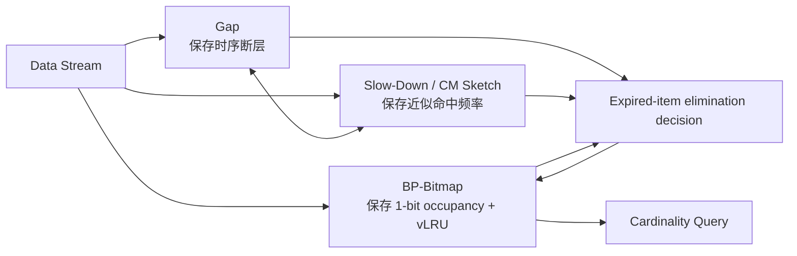

> **论文**：Xuyang Jing, Qinghua Cao, Chenhao Zhang, Zheng Yan, Wenxiu Ding, Witold Pedrycz, Pu Wang. *TardySketch: A Framework for Cardinality Estimation Adaptable to Sliding Windows*.
>
> **阅读定位**：这篇论文不是在重新发明一个“更准的 Bitmap 估计器”，而是在回答一个更基础的问题：**当 Bitmap 被放进滑动窗口后，如何让“删除过期元素”这件事本身不破坏基数估计？**

---

### 开头：发表信息、CCF 级别与开源情况

- 📅 **发表时间**：2025 年 5 月；论文收录于 **2025 IEEE 41st International Conference on Data Engineering (ICDE 2025)**，页码 2990–3002，DOI：`10.1109/ICDE65448.2025.00224`。ICDE 2025 于 2025 年 5 月 19–23 日在中国香港举行。
- 🏆 **会议级别**：ICDE 属于 **CCF A 类**“数据库/数据挖掘/内容检索”国际学术会议；CORE/ICORE 体系中为 A*。
- 💻 **是否开源**：**是**。论文正文明确写明源代码已公开，并在参考文献 [39] 给出仓库地址。不过有一个值得注意的小细节：正文写的是 “available on GitHub”，而论文参考文献实际提供的是 `anonymous.4open.science` 的匿名代码仓库，而不是一个可直接核验的 GitHub 正式仓库。
- 🔗 **论文给出的公开代码地址**：https://anonymous.4open.science/r/TardySketch4ICDE-B76D
- 🔗 **论文记录（DBLP）**：https://dblp.org/rec/conf/icde/JingCZYDPW25
- 🔗 **ICDE 2025 官网**：https://ieee-icde.org/2025/
- 🔗 **CCF ICDE 条目**：https://www.ccf.org.cn/c/2017-03-17/587911.shtml

> **一句先导判断**：TardySketch 最有价值的地方，不是把经典 Bitmap 的估计公式改得更复杂，而是把“滑动窗口中的删除”从一个粗暴的 **bucket reset** 操作，重构为一个接近“事件级删除”的延迟、分摊式过程。

---

## 1. 摘要 (Abstract) 与核心贡献 (Core Contribution)

### 一句话总结

**TardySketch 通过 BP-Bitmap 记录 bucket 的相对访问顺序，再用 Gap 机制恢复因碰撞导致的时间断层、用 Slow-Down 机制把一次 bucket 清零延迟为多次“逻辑删除”，从而缓解滑动窗口 Bitmap 中因错误删除和过度删除引起的系统性低估。**

### 贡献列表 (Contribution List)

- 🧩 **提出并形式化了 “cardinality barrel-down（基数桶崩/基数骤降）” 问题**：指出滑动窗口下 Bitmap 的误差不仅来自哈希碰撞本身，更来自“如何删除过期元素”这一操作。作者进一步将其拆解为：
  1. **item error-elimination**：删错了，本应保留的 bucket 被提前删除；
  2. **item over-elimination**：删多了，一个 bucket 中的多个重复/碰撞元素被一次性全部抹掉。
- 🧱 **提出 BP-Bitmap + Gap + Slow-Down 的三层框架**：
  - BP-Bitmap 用双向指针构造虚拟 LRU，避免为每个元素保存时间戳；
  - Gap 记录“逻辑队列中的时间断层”，解决错误删除；
  - Slow-Down 用 Count-Min Sketch 近似 bucket 命中频率，把一次物理清零拆成多次逻辑衰减，解决过度删除。
- 📊 **给出理论误差边界，并在 CAIDA/MAWI 网络流数据上验证**：论文报告 TardySketch 的相对误差通常显著低于 TSV、CVS、LRU-S、SHE 等基线，整体误差约为基线的 **1/10–1/40**；同时验证了参数稳定性、内存效率、吞吐和对 SMB/MRB 等 Bitmap 变体的兼容性。

---

## 2. 引言 (Introduction)：问题背景与研究动机

### 2.1 问题定义 (Problem Definition)

基数估计（cardinality estimation）关注集合中**不同元素的数量**。对于高速数据流，我们往往无法保存全部数据，因此使用 Bitmap、HyperLogLog、KMV 等 sketch 结构做近似统计。

传统“离散窗口”比较简单：一个窗口结束后，整个计数结构可以清空，然后开始下一段。但滑动窗口不同：窗口每向前移动一步，就必须同时完成两件事：

1. 新元素进入窗口；
2. 最老的元素离开窗口。

论文关注的是 **count-based sliding window**：窗口由最近的 $W$ 个数据项组成，而不是“最近 10 秒”这类 time-based 窗口。作者明确选择 count-based 的原因是：如果为每个元素保存时间戳，内存代价会很大，而数据流算法恰恰最关心受限内存下的一遍处理。

对长度为 $m$ 的经典 Bitmap，若当前有 $u$ 个 0-bit bucket，基数估计为：

$$
\hat n=-m\ln\frac{u}{m}.
$$

这里真正的难点不是“插入”，而是**删除**。

由于哈希映射是 many-to-one，一个 1-bit bucket 很可能对应：

- 同一元素多次出现；
- 多个不同元素发生哈希碰撞。

于是，当某个过期元素离开窗口时，你并不知道这个 bucket 里是否还代表着其他**未过期元素**。如果简单把 bit 从 1 清成 0，就可能一次删掉多个有效信息。

### 2.2 现有方法的局限 (Limitations of Prior Work)

论文将先前方法大致分为两类。

#### 路线 A：基于时间戳

代表方法包括 TSV、S-HLL 等。思路是给 bucket 或元素保存到达时间，然后比较当前时刻与时间戳来判断是否过期。

它们的问题很直接：

- 时间戳通常需要几十比特（论文以 64-bit 为例）；
- 有些方法还需要维护列表；
- 在资源受限、高速数据流环境中，空间和遍历代价较大。

更重要的是，即使知道“某个历史元素已经过期”，**你仍然不能保证直接 reset 它所在的 bucket 是安全的**。

#### 路线 B：基于 freshness / aging

CVS、SHE 等不保存精确时间戳，而是通过衰减、扫描、age-sensitive cleaning 等机制近似判断 bucket 是否“足够旧”。

这类方案通常更省内存，但会引入：

- 扫描速度、衰减率等敏感参数；
- 对数据分布和窗口大小较敏感；
- 过期识别本身是近似的，容易误删。

### 2.3 真正的痛点：Cardinality Barrel-Down

论文 Figure 2–3 很重要，它们几乎把整篇工作的动机讲完了。


**Figure 2(a)** 说明了一个非常关键的非线性现象：Bitmap 越接近饱和，清掉一个 1-bit bucket 所造成的基数下降越夸张。

若当前 0-bit 数量为 $u$，reset 一个 1-bit 后变成 $u+1$ 个 0-bit，则估计值下降量为：

$$
\Delta z
=\hat n(u)-\hat n(u+1)
=m\ln\left(1+\frac{1}{u}\right).
$$

当 $u$ 很小时，$\Delta z$ 很大。论文举例：当 $m=8K$ 且 $u<128$ 时，**仅 reset 一个 bucket 就可能让估计基数下降 60 以上**。

这意味着：

> 在高负载 Bitmap 中，“删除一个错误 bucket”不是一个局部的 1 个元素误差，而可能被非线性放大成几十个元素的估计偏差。

Figure 3 则给出两个机制层面的根因：

- **error-elimination**：哈希碰撞会把某 bucket 的“最近时间”更新，导致队列/时间顺序发生扭曲，随后错误地删除了另一个尚未过期的 bucket；
- **over-elimination**：一个 bucket 可能承载同一元素的多次出现或多个碰撞元素，直接清零相当于一次删掉多个窗口内仍有效的“贡献”。

### 2.4 本文思路 (Overall Idea)

作者的思路可以概括成一句话：

> **不试图精确保存每个元素，而是保存“bucket 的相对时序 + 被压缩掉的时间间隔 + bucket 的近似命中次数”。**

这三类信息分别对应：

- **BP-Bitmap**：谁最近被访问，谁最老；
- **Gap**：因为 bucket 被移动，逻辑队列中到底“跳过了多少历史到达事件”；
- **Slow-Down**：一个 bucket 里大概压缩了多少次到达，不要一次性清零。

这也是论文最漂亮的地方：它没有回到“为每个元素记录完整时间戳/指纹”的昂贵方案，而是尽量在 bucket 层面保存**刚刚够用的结构性信息**。

---

## 3. 方法论深度解析 (In-depth Methodological Analysis)

### 3.1 整体架构 (Overall Architecture)

论文 Figure 4 给出了 TardySketch 的总览，Figure 5–6 展示了 BP-Bitmap 与更新过程。


可以把整个系统理解成三条并行维护的“信息通道”：



一次新元素到达时：

1. 哈希到 BP-Bitmap 的某个 bucket；
2. 更新该 bucket 在虚拟 LRU（vLRU）中的位置；
3. 如果因为移动 bucket 造成了时间顺序“断层”，更新 Gap；
4. Slow-Down 对该 bucket 的 hit frequency 加 1；
5. 窗口向前滑动时，根据 vLRU head 的 `gap` 与 `hf` 决定：是立即 reset，还是只递减逻辑计数，抑或去其他高频 bucket 做一次近似消减。

查询时反而很简单：只需要 BP-Bitmap 的 1-bit 占用状态；Gap 和 Slow-Down 只参与**维护与删除决策**，不直接改变最终的 Bitmap 估计公式。

#### 架构上的核心差异

传统滑动窗口 sketch 往往试图回答：

> “哪个 bucket 过期了？”

TardySketch 则把问题拆成了两个更细的问题：

1. **时间层面**：当前 head 真的是下一个应该被删除的 bucket 吗？—— Gap 负责；
2. **计数层面**：即使这个 bucket 包含过期元素，现在真的应该整桶清零吗？—— Slow-Down 负责。

这两个问题分别对应“删错”和“删多”，逻辑上非常清楚。

---

### 3.2 核心组件/模块拆解 (Core Component Breakdown)

#### 3.2.1 BP-Bitmap：把 Bitmap 变成一个“可维护相对时间顺序”的结构

##### 输入与输出

- **输入**：流元素 $e$；
- **内部定位**：

$$
pos=h(e)=H(e)\bmod m;
$$

- **输出/状态变化**：更新 `BP[pos].bit`，并维护该 bucket 的 `pre`、`suc` 双向指针，使所有活跃 bucket 构成虚拟 LRU（vLRU）。

##### 内部机理

每个 bucket 包含三个基础字段：

- `bit`：传统 Bitmap 的占用位；
- `pre`：前驱 bucket 指针；
- `suc`：后继 bucket 指针。

于是所有当前为 1 的 bucket 不只是“散落在数组里”，而是另外形成一个双向链表：

$$
vLRU.head \rightarrow \text{oldest bucket} \rightarrow \cdots \rightarrow \text{newest bucket} \rightarrow vLRU.tail.
$$

对于新到元素，有两种情况。

**U1：命中 inactive bucket**

如果 `bit=0` 且指针为空：

- 将 bit 置 1；
- 通过 `add_last` 把它插到 vLRU 尾部。

它相当于第一次被当前窗口“激活”。

**U2：命中 active bucket**

如果 `bit=1`：

- 说明该 bucket 之前已经被某个元素占用；
- 当前新元素使这个 bucket 再次变“新”；
- 因此执行 `shift_tail`，把它移动到 vLRU 尾部。

##### 设计动机

如果直接给每个 bucket 保存 64-bit 时间戳，空间很贵；作者改为保存 bucket 之间的相对顺序。

指针的空间规模是 $\log_2 m$ bit，因此对常见的 $m\ll2^{32}$，理论上比 64-bit timestamp 更紧凑。

同时，head 就是“最老的活跃 bucket”，因此候选删除可以做到 $O(1)$，无需扫描整个 Bitmap。

##### 但 BP-Bitmap 自身还不够

这是论文设计中非常关键的一点：**作者没有把 BP-Bitmap 当作最终答案。**

`shift_tail` 会把一个中间 bucket 抽走，并把它的前驱与后继直接连起来。于是“链表相邻”不再等价于“真实到达时间相邻”。

这正是 Gap 机制存在的原因。

---

#### 3.2.2 Gap：记录“vLRU 里看不见的时间”

论文 Figure 7 是理解 Gap 最重要的一张图。


##### 输入与输出

- **输入**：发生 `shift_tail` 的 bucket 以及其原来的 predecessor/successor；
- **输出**：更新 predecessor 的 `gap` 字段，记录真实时间轴上被链表结构“跨过去”的事件数量。

##### 内部机理

假设 bucket $x=BP[pos]$ 原本位于链表中间：

$$
pre \rightarrow x \rightarrow suc.
$$

由于新元素再次命中 $x$，它被移动到 tail：

$$
pre \rightarrow suc,\qquad \cdots \rightarrow x.
$$

但真实时间上，`pre` 与 `suc` 之间并不是连续的。被移走的 $x$ 代表了一个“时间事件”。如果 $x$ 自己之前还累积了一段 gap，那么这些断层也必须一起转移。

所以作者使用：

$$
pre.gap \leftarrow pre.gap + x.gap + 1,
$$

$$
x.gap \leftarrow 0.
$$

直觉上：**Gap 不是在记录“时间戳”，而是在记录“链表结构压缩掉了多少个到达事件”。**

Figure 7 中，经过 $e_5,e_6,e_7$ 与旧 bucket 的碰撞/重复访问后，vLRU 表面上的顺序已经不是严格的 $t_1,t_2,\ldots$；但例如 `BP[1].gap=3` 表明：虽然 BP[1] 与下一个 bucket 在链表中相邻，真实时间轴上中间其实还跨过了 3 个到达事件。

##### 它具体解决什么？

它解决的是 **item error-elimination**。

没有 Gap 时，head 被删除之后，系统会自然地把链表下一个 bucket 当成“下一个最老 bucket”；但这个假设可能是错的，因为真正更老的 bucket 可能早已被 `shift_tail` 挪到了尾部。

Gap 让系统知道：

> “当前 head 后面不是紧接着下一个真实时刻，中间还有若干已被移动的历史事件尚未逻辑删除。”

##### 设计动机

一个很值得学习的设计思想是：作者没有尝试恢复完整的真实顺序，因为那又会回到维护全量时间信息的高成本方案。

Gap 只记录**“断层长度”**，不记录断层中每一个 bucket 的身份。

这是一种典型的 sketch 思维：

> 不恢复完整历史，只保留对最终决策足够的统计量。

当然，它也因此引出了后续的近似操作：当 gap 大于 0 时，作者实际上并不知道“被移到尾部的那个最老 bucket 到底是哪一个”，只能近似地做逻辑消减。

---

#### 3.2.3 Slow-Down：从“整桶删除”变成“逐次扣减”

##### 输入与输出

- **输入**：每次被访问 bucket 的位置 `pos`；
- **内部结构**：论文使用一个 $d\times w$ 的 Count-Min Sketch；
- **输出**：对任意 bucket，近似查询其 hit frequency：

$$
BP[pos].hf.
$$

##### 为什么需要 hit frequency？

假设一个 bucket 被命中了 4 次。

从 Bitmap 角度看，它始终只是一个 `1`；但从滑动窗口角度看，这 4 次到达分别会在未来四个不同的滑动时刻逐渐过期。

如果第一个到达事件一过期就直接把 bit 清 0，相当于把另外 3 个仍在窗口中的事件一起删掉。

Slow-Down 的思路是：

> **bit 是否清零，不看“是否有一个过期事件”，而看这个 bucket 中的有效事件贡献是否已经被逐步消耗到只剩最后一个。**

##### 三种消除状态 S1/S2/S3

论文把删除逻辑分为三种情况。

**S1：`gap = 0` 且 `hf = 1`**

说明：

- 当前 head 确实就是下一个应该过期的 bucket；
- bucket 只对应一次命中。

因此可以安全地：

$$
bit\leftarrow0.
$$

**S2：`gap = 0` 且 `hf > 1`**

当前 bucket 虽然最老，但它压缩了多个 arrival。

所以不清 bit，只做：

$$
hf\leftarrow hf-1.
$$

窗口继续滑动，直到 `hf=1`，之后才进入 S1 真正 reset。

这就是 “Slow-Down” 这个名字的来源：**降低 bucket 物理 reset 的速度**。

**S3：`gap > 0`**

这意味着有一些更老的 arrival 所属 bucket 已经因为 `shift_tail` 被移动到了 vLRU 后方。

但是 Gap 只知道“有几个”，不知道“是谁”。因此作者采取近似处理：

- 随机选择一个 `hf>1` 的 bucket；
- 将它的 hit frequency 减 1；
- 同时 `head.gap -= 1`；
- 直到 gap 降为 0，再回到 S2/S1。

这是全文最“工程化”、也最值得批判性审视的一步：**作者用频率层面的守恒近似，替代身份层面的精确删除。**

为什么这个近似仍然可行？作者的核心理由是：Bitmap 最终只关心有多少个 1-bit，而不关心具体是哪几个元素落在哪个 bucket。只要系统不要过早把一个仍应保持 1 的 bucket 清成 0，基数误差就能大幅减小。

---

### 3.3 关键公式与算法 (Key Equations and Algorithms)

#### 公式 1：Bitmap 基数估计及“单次 reset 放大效应”

经典估计式：

$$
\hat n=-m\ln\frac{u}{m},
$$

其中：

- $m$：Bitmap bucket 总数；
- $u$：当前仍为 0 的 bucket 数；
- $\hat n$：估计的 distinct cardinality。

其来源直觉是：如果元素均匀哈希到 $m$ 个 bucket，那么一个 bucket 在 $n$ 次独立投掷后仍为空的概率近似为：

$$
\left(1-\frac1m\right)^n\approx e^{-n/m}.
$$

于是：

$$
\frac{u}{m}\approx e^{-n/m},
$$

取对数即可反解 $n$。

真正与本文创新直接相关的是 reset 一个 1-bit 后的偏差：

$$
\Delta z=m\ln\left(1+\frac1u\right).
$$

**目标**：量化“错误 reset 一个 bucket”有多危险。

**直觉**：当 $u$ 很大时，Bitmap 很稀疏，误删一个 1-bit 影响有限；当 $u$ 很小时，Bitmap 接近饱和，估计函数的斜率变得非常陡，一个 bit 的变化会被放大成很大的 cardinality 变化。

这解释了为什么 sliding window 中不断发生的小规模 reset 错误，会最终表现为 Figure 2(b)、Figure 9 中那种持续向下塌陷的估计曲线。

---

#### 关键算法：TardySketch 的“延迟删除状态机”

把论文的 Gap + Slow-Down 合起来，可以抽象成下面的伪代码：

```text
for each arriving item e:
    pos = h(e)

    if BP[pos] is inactive:
        set BP[pos].bit = 1
        append BP[pos] to vLRU.tail
    else:
        # 被重复访问/碰撞命中，准备移到尾部
        predecessor.gap += BP[pos].gap + 1
        BP[pos].gap = 0
        move BP[pos] to vLRU.tail

    SD.increment(pos)   # Count-Min Sketch 记录 hit frequency

when window slides by one item:
    b = vLRU.head.next
    hf = SD.query(b)

    if b.gap == 0 and hf == 1:
        reset b.bit to 0
        remove b from vLRU

    elif b.gap == 0 and hf > 1:
        SD.decrement_logically(b)

    else:  # b.gap > 0
        choose a bucket with hf > 1
        decrement its logical hit count
        b.gap -= 1
```

这个算法的真正核心不是某一行，而是一个思想转换：

> **滑动窗口每前进一步，应删除的是“一个 arrival contribution”，而不是“一个 bucket”。**

传统 Bitmap 的错误在于把这两者混为一谈；TardySketch 则用 Gap 和 hit frequency 去近似恢复这种一对一关系。

---

### 3.4 复杂度与理论保证：应该如何理解

论文给出的结论是：

- 更新：$O(1)$；
- 删除：$O(1)$；
- 查询：$O(1)$；
- BP-Bitmap 空间：$O(m\log m)$；
- 再加 Gap 与 Slow-Down 的辅助空间。

其中，更新 Slow-Down 需要访问 Count-Min Sketch 的 $d$ 个计数器，因此严格说是 $O(d)$，但作者把 $d$ 当作小常数，所以写成 $O(1)$。

论文还给出单步窗口移动后发生 underestimation / overestimation 的概率上界。其主要作用不是让我们手工计算，而是说明：在均匀哈希、固定 load factor 等假设下，TardySketch 的两侧误差都可以被控制，而不是一个无界漂移过程。

不过这里需要强调：**这些定理主要是“单步发生某类估计偏差的概率界”，并不等价于对长时间窗口滑动后的累计 RE 给出紧致上界。**这一点在后面的批判性讨论中还会回到。

---

## 4. 实验设计与结果分析 (Experimental Design and Results Analysis)

### 4.1 实验设置 (Experimental Setup)

论文使用 4 个网络流数据集，来自 **MAWI** 和 **CAIDA**，记为 DS1–DS4，并按规模从大到小排列。每个数据集取 300 万条 item，使窗口能够持续滑动多轮。


Table II 中测试的窗口大小为：

$$
2^{16},\quad 2^{17},\quad 2^{18}.
$$

对应不同数据集，其窗口内 distinct cardinality 从约 $5\times2^{10}$ 到 $23\times2^{10}$ 不等。

**评价指标**：

- 相对误差：

$$
RE=\frac{|\tilde R-R|}{R},
$$

其中 $\tilde R$ 为估计值，$R$ 为真实值；
- 吞吐：Mops（million operations per second）。

**主要基线**：

- TSV；
- CVS；
- LRU-S；
- SHE（Bitmap）；
- 另外在非 Bitmap 对比中使用 S-HLL、SWAMP、QSketch。

**默认配置**：

- 总内存：10 KB；
- 窗口大小：$2^{18}$；
- 先装满一个窗口再开始滑动；
- 每次滑动步长为 1；
- 每滑动 $0.5W$ 记录一次指标；
- 总共滑动 $5W$，用来显式暴露累计误差。

### 4.2 参数敏感性


Slow-Down 使用 Count-Min Sketch，因此主要参数是 $d$ 和 $w$。

Figure 8(a) 显示：

- 当 $d=1$ 时，CM Sketch 冲突过多，RE 明显变差；
- 当 $d\ge2$ 后，RE 基本稳定在 0.05 以下。

作者因此取：

$$
d=2.
$$

Figure 8(b) 测试 $w=m/2,m/3,m/4,m/5$，曲线差异不大，作者最终使用：

$$
w=m/2.
$$

这确实说明 TardySketch 不需要像某些 freshness-based 方法那样对很多衰减参数进行精细调节。

但从科学结论的强度上说，这一实验只能证明：**在 20 KB、$W=2^{18}$ 及论文四个网络数据集上，$d,w$ 在该范围内较稳定**；还不能完全推出“对任意工作负载都 parameter-insensitive”。

---

### 4.3 消融实验 (Ablation Studies)

Figure 9 是全文最有说服力的实验之一。


作者比较：

- **BP-Bitmap alone**；
- **BP-Bitmap + Gap + Slow-Down = 完整 TardySketch**。

结果非常清楚：

- BP-Bitmap 在初始化时刻还比较准确；
- 随着窗口移动，估计值快速衰减；
- TardySketch 则长期贴近真实基数。

这直接验证了论文最重要的方法论判断：

> **仅仅知道“哪个 bucket 更老”是不够的；如果不修复时间断层、也不处理 bucket 内多重贡献，cardinality barrel-down 仍然会发生。**

#### 哪个部分贡献最大？

严格按照论文实验，我们**不能**回答“Gap 和 Slow-Down 谁贡献更大”。

原因是作者明确指出 Slow-Down 的删除逻辑依赖 Gap 提供的信息，两者不能完全独立运行，因此消融只做了：

$$
BP\text{-Bitmap}\quad vs.\quad BP\text{-Bitmap}+Gap+SD.
$$

所以能得出的最强结论是：

> **Gap + Slow-Down 这一组联合优化是性能提升的决定性来源。**

但“错误删除”和“过度删除”各自贡献了多少误差、Gap 单独能修复多少、SD 单独能修复多少，论文没有给出可分离的量化证据。

这是实验设计上的一个明显缺口。

---

### 4.4 主实验结果 (Main Results)

Figure 10 汇总四个数据集上的平均/最大/最小 RE。

论文报告：TardySketch 的误差始终最低且最稳定，误差大约只有基线的：

$$
\frac{1}{10}\sim\frac{1}{40}.
$$

这不是简单的“方法 A 比方法 B 好一点”。更重要的是它验证了作者在方法论部分的核心假设：

- 如果错误主要来自普通随机估计噪声，那么随着窗口移动，不应该出现 BP-Bitmap 那种持续向下塌陷；
- 实际上，基线在大窗口、大规模数据上误差显著放大；
- TardySketch 恰恰通过控制删除过程，阻止了这种随滑动累积的系统性低估。

换句话说，实验现象与“cardinality barrel-down 是滑动删除造成的结构性偏差”这一解释是吻合的。

### 4.5 不同窗口大小与不同内存

Figure 11–12 进一步测试：

- 窗口：$2^{16},2^{17},2^{18}$；
- 内存：10 KB、15 KB、20 KB。

规律很一致：

- 数据集越大、窗口越大，基线通常越容易累积误差；
- 内存越小，基线误差也更容易放大；
- TardySketch 在这些变化下仍保持最低或接近最低的 RE。

这与方法机制也一致：窗口越大、冲突/重复累积越多，直接 reset bucket 的危害越大，Gap + Slow-Down 的价值就越明显。

### 4.6 与非 Bitmap 方法的内存对比

Table III 很有冲击力：在 DS1 上达到同一 RE 时，论文给出的内存需求为：

| 方法 | RE=0.05 | RE=0.2 | RE=0.5 |
|---|---:|---:|---:|
| S-HLL | 364 KB | 192 KB | 144 KB |
| SWAMP | 1497 KB | 1395 KB | 1088 KB |
| QSketch | 1638 KB | 819 KB | 204 KB |
| **TardySketch** | **10 KB** | **8 KB** | **6 KB** |

这说明本文的优势并不只是“在 Bitmap 家族里更准”，还体现为：**在低内存预算下，作者选择的 bucket-level 时序近似比保存时间/指纹信息更有性价比。**

不过也要注意，这种表格是“达到同一 RE 时的内存反查”，不同方法的结构和优化目标并不完全一致，因此它更适合作为工程性比较，而不是严格的理论 dominance 证明。

---

### 4.7 具体实现细节

论文实现环境如下：

- Python；
- 哈希函数：`xxhash64`；
- CPU：Intel Xeon Silver 4210R，10 核 20 线程，2.40 GHz；
- 内存：64 GB；
- 系统：Ubuntu 18.04 LTS。

论文的 Slow-Down 使用 **Count-Min Sketch**，默认：

$$
d=2,\qquad w=m/2.
$$

查询基数时，作者不需要再遍历整个 Bitmap。BP-Bitmap 维护 vLRU 当前长度 $LR$，因此：

$$
u=m-LR,
$$

随后直接代入：

$$
\hat n=-m\ln\frac{m-LR}{m}.
$$

从而把 query 也降到 $O(1)$。

---

### 4.8 效率与通用性


Figure 13 显示 gap 平均值稳定在约 13 左右，没有持续增长到让算法“卡死”在某些 bucket 上。

时间开销上，BP-Bitmap 自身只占更新过程的一小部分，Gap/Slow-Down 占据更多 CPU 时间；论文报告每次“新元素更新 + 过期元素处理”的平均时间约：

$$
2.5\times10^{-5}\text{ s}.
$$

Figure 14 中，LRU-S 吞吐最高，因为其删除逻辑最简单；TardySketch 的吞吐不是第一，但在精度明显更高的同时仍保持较好的速度。

Figure 15 将 TardySketch 框架套到 SMB、MRB 上，记为 TS+SMB、TS+MRB。三种版本都保持较低 RE，说明作者提出的机制并非只对最基础 Linear Counting Bitmap 有效。

这为“框架性”主张提供了证据，但证据范围仍主要局限在 Bitmap 家族。

---

## 5. 讨论与思考 (Discussion and Reflection)

### 5.1 优点与创新点 (Strengths & Innovations)

#### ✅ 优点 1：抓住了一个此前容易被忽略的“删除语义错误”

很多 sketch 工作会把误差归因于“哈希碰撞”“计数器位数不足”“参数设置不合理”。TardySketch 的贡献在于进一步指出：

> **在 sliding window 中，最致命的不是碰撞本身，而是你如何在碰撞存在时执行删除。**

这是一个很有解释力的视角。

#### ✅ 优点 2：问题拆解非常干净

- 错误删除 → Gap；
- 过度删除 → Slow-Down。

这种一一对应关系让论文非常容易验证和理解，也让设计显得“不是堆模块”，而是有明确因果链。

#### ✅ 优点 3：保留相对信息，而不是追求完整信息

BP-Bitmap 不保存真实 timestamp；Gap 不保存完整被移动 bucket 序列；Slow-Down 不保存每个元素精确频率，而是用 CM Sketch。

它们共同体现了流式算法的核心哲学：

> **只保存会改变最终决策的信息，而不是保存原始事实本身。**

#### ✅ 优点 4：实验现象与方法假设高度一致

BP-Bitmap-only 随滑动快速下坠，而完整 TardySketch 保持稳定；这个消融现象几乎是对“barrel-down”假说的直接可视化验证。

---

### 5.2 局限性与可商榷之处 (Limitations & Debatable Points)

#### ⚠️ 局限 1：Gap 与 Slow-Down 的贡献没有被真正拆开

论文声称：

- Gap 解决 error-elimination；
- SD 解决 over-elimination。

但实验上只比较 BP-Bitmap 和“Gap+SD 全开”，没有独立量化：

- 仅 Gap 能恢复多少；
- 仅用精确 frequency 替代 CM 时有多大提升；
- S3 的随机逻辑删除到底贡献了多少误差。

因此方法解释是可信的，但**每个机制的因果贡献仍没有完全被实验识别**。

#### ⚠️ 局限 2：S3 是一个“知道数量，不知道身份”的近似补偿

当 `gap>0` 时，算法并不知道真正该删除哪个被移到 tail 的 bucket，只能随机找一个 `hf>1` 的 bucket 做逻辑扣减。

这实际上利用了一个重要假设：

> 对 cardinality 来说，“维护总体 1-bit 数量合理”比“维护元素身份正确”更重要。

对纯 cardinality 估计，这个假设可能成立；但如果以后扩展到需要 key identity 的任务，比如 per-flow 测量、heavy hitter 或复杂聚合，S3 的随机补偿是否仍然无害，需要重新证明。

#### ⚠️ 局限 3：理论界更像单步概率界，而不是长期 RE 界

Theorem 1/2 给的是窗口移动一步时触发 under/over-estimation 的概率上界。

但实际系统最关心的是：

$$
\text{经过 }10^6\text{ 次滑动后，误差是否会系统性累积？}
$$

单步事件概率并不能直接回答长期误差的相关性、偏置和稳态分布。

论文通过实验弥补了这一点，但从理论完整性上仍有提升空间。

#### ⚠️ 局限 4：空间复杂度的表述值得进一步推敲

论文称每个 bucket 都有 `gap` 字段，又给出 Gap 机制空间需求与总 gap 值 $W-T$ 相关。

从实际实现角度看，如果 `gap` 是 per-bucket 可更新字段，那么其位宽和总存储量如何编码、是否固定分配、是否会成为大 $m$ 下的主要开销，值得更明确说明。

同样，BP-Bitmap 的两个双向指针本身是明显的常数开销：

$$
\approx 2m\log_2m
$$

级别。对于“10 KB 总内存”的实验，如何在 BP 指针、gap 字段、CM Sketch 之间精确分配内存，论文正文没有给出足够细的 breakdown。

#### ⚠️ 局限 5：参数不敏感性验证范围仍有限

作者只在有限 $d,w$ 范围、20 KB 和 $W=2^{18}$ 等设置下证明稳定。

如果数据分布极度倾斜、重复率极高，或者 adversarial hash collision 很强，CM Sketch 的冲突可能让 hit frequency 估计偏高，继而让 bucket reset 被过度延迟，产生 over-estimation。

因此“parameter insensitive”更准确的说法应该是：

> 在论文测试的典型网络流工作负载和参数区间内表现稳定。

#### ⚠️ 局限 6：工作负载类型比较单一

引言举了网络异常检测、交易欺诈、供应链等例子，但实验全部来自 CAIDA/MAWI 网络流。

网络流往往具有明显的 heavy-tail、重复访问和源/目的地址结构。TardySketch 在：

- 电商 user ID；
- 广告曝光 ID；
- IoT event；
- 高 burst / 周期性 workload；

上的行为还没有被验证。

#### ⚠️ 局限 7：吞吐“高效”更多是相对意义，而非线速实现

论文实现使用 Python，Figure 14 的吞吐在亚 Mops 量级。作为算法间公平比较没有问题，但如果场景是 10/40/100Gbps 网络测量，这一绝对吞吐显然距离线速还有很大差距。

所以论文证明的是**算法结构具有 O(1) 维护和较好相对吞吐**，而不是证明当前 Python 实现已经具备 production line-rate 能力。

---

### 5.3 未来工作与启发 (Future Work & Inspirations)

论文最后明确提到未来会探索 **sliding heavy hitter detection**。我认为更有价值的后续方向至少有以下几个。

#### 🚀 方向 1：把 “Gap” 从标量升级为可恢复身份的轻量结构

现在 Gap 只能告诉你：

> 中间漏掉了 $k$ 个 arrival。

但不知道是哪几个 bucket。

可以考虑用极小的 fingerprint queue、reservoir、XOR accumulator 或可逆 sketch，使系统在低额外内存下，至少以一定概率恢复“被 shift 的 bucket 身份”。

这样 S3 就不必随机扣减，理论误差可能进一步下降。

#### 🚀 方向 2：设计自适应 Slow-Down

目前 Slow-Down 使用固定 $d,w$ 的 Count-Min Sketch。

可以考虑根据：

- 当前 load factor $\alpha=T/m$；
- Bitmap 饱和度 $u/m$；
- gap 的分布；
- bucket hit frequency 的偏斜度；

动态分配 SD 内存。

尤其当 $u$ 很小时，由于单 bit reset 的风险大幅上升，系统应更谨慎地执行 reset。

#### 🚀 方向 3：给出长期稳态误差理论

比单步错误概率更有意义的是研究：

$$
\mathbb E[RE_t],\quad \mathrm{Var}(RE_t),\quad t\to\infty.
$$

也就是：在平稳或非平稳流下，TardySketch 是否存在误差稳态？是否会出现系统偏置？Gap 与 CM 冲突的误差是否具有 martingale / Markov 特性？

这是一个很适合理论化的方向。

#### 🚀 方向 4：硬件化/可编程交换机实现

BP-Bitmap 的双向链表指针更新并不天然适合 P4/ASIC 的受限随机访存模型。

如果目标是网络遥测，真正有挑战的问题是：

> 如何把 `shift_tail + gap transfer + CM update` 映射成固定 pipeline stage、有限寄存器读写的实现？

这可能比 Python/C++ 软件加速更有研究价值。

#### 🚀 方向 5：从“distinct cardinality”推广到更一般的滑动窗口压缩统计

TardySketch 的本质是把“物理 bucket”与“逻辑 arrival contribution”分离。

这个思想可能适用于：

- sliding heavy hitter；
- sliding spread / super-spreader；
- distinct-per-key；
- sliding entropy；
- 时序图中的邻居基数。

它的启发不是“以后都用 BP-Bitmap”，而是：

> **当 sketch 的一个存储单元压缩了多个逻辑事件时，滑动窗口删除必须考虑“单元级状态”和“事件级过期”之间的语义不一致。**

---

### 5.4 我会继续追问作者的几个问题

1. **S3 的随机 decrement 如果改成按 `hf` 加权采样，会不会比均匀随机更稳定？**
2. **如果用精确 per-bucket hit counter 替代 CM Sketch，TardySketch 的误差上限能下降多少？这能量化 CM 冲突造成的误差份额。**
3. **当 Bitmap load factor 极高、$u\to0$ 时，是否应该主动扩容/采样，而不是仅靠 Slow-Down 避免 reset？**
4. **Gap 的分布是否与 workload 的重复率/Zipf 参数有可预测关系？如果有，可以据此动态分配空间。**
5. **在 time-based sliding window 中，如果到达速率高度变化，是否可以用 TardySketch 的相对顺序思想替代部分 timestamp？**
6. **框架能否用于 HLL/KMV？论文把非 Bitmap 结构留给未来工作，而这恰恰是“通用框架”主张最值得验证的下一步。**

---

## 结语：如何抓住这篇论文的“真正创新”

如果只看模块名，TardySketch 很容易被理解成：

> “Bitmap + LRU + 一个 gap counter + 一个 Count-Min Sketch。”

但这样会低估它。

它真正重要的贡献是重新定义了滑动窗口 sketch 中的删除问题：

> **一个过期 arrival 离开窗口，并不意味着应该把一个物理 bucket 立刻清零。**

因为一个 bucket 是多个逻辑 arrival 的压缩结果，正确的删除必须先恢复“它还承载多少有效贡献”，并处理由于重复访问导致的时序错位。

从这个角度看：

- BP-Bitmap 解决“相对时序在哪里”；
- Gap 解决“时序断层有多大”；
- Slow-Down 解决“这个 bucket 还剩多少逻辑贡献”；
- 最终的 Bitmap 估计公式反而完全不需要修改。

这是一种非常典型、也很值得借鉴的系统/算法研究范式：

> **不动最终 estimator，而是修正 estimator 所依赖的状态维护语义。**

---

## 参考与核验链接

- 论文 DOI：https://doi.org/10.1109/ICDE65448.2025.00224
- DBLP：https://dblp.org/rec/conf/icde/JingCZYDPW25
- ICDE 2025：https://ieee-icde.org/2025/
- CCF ICDE：https://www.ccf.org.cn/c/2017-03-17/587911.shtml
- 论文公开代码：https://anonymous.4open.science/r/TardySketch4ICDE-B76D
- CAIDA Dataset：https://www.caida.org/catalog/datasets/
- MAWI Dataset：http://mawi.wide.ad.jp/mawi/

> 注：本文的技术解读以用户提供的 ICDE 2025 论文 PDF 为主要依据；会议时间/CCF 分级等元数据额外参考了 ICDE、CCF 与 DBLP 的公开页面。
